# Authentication Flows

This note explains how authentication works across the Eric's Barbers frontend and backend.

It covers:

- how the Next.js application handles login, registration, email verification, protected pages, and logout
- how the NestJS API implements authentication use cases
- how PostgreSQL stores users and sessions through Prisma
- current design decisions, trade-offs, and implementation gaps

Related note: [[Database Design]]

## High-Level Architecture

Authentication is split across three layers:

1. The Next.js frontend renders the user interface and handles browser-facing flows.
2. The NestJS backend owns the real authentication rules and token generation.
3. PostgreSQL stores users, password hashes, verification state, and refresh-token sessions.

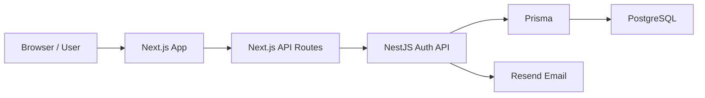

Browser-facing auth requests should go through the Next.js BFF route handlers under `/api/auth/*`.

The generated OpenAPI client can still be useful for non-auth backend resources, but browser auth flows should not call NestJS auth endpoints directly. Next.js needs to own the browser-facing HttpOnly cookies, refresh retries, local logout behavior, and same-origin checks.

This split matters because cookies behave differently depending on whether the browser is talking to the Next.js app or directly to the backend API.

## Main Backend Auth Components

The backend auth module is wired in:

`erics-barber-api/src/modules/auth/auth.module.ts`

The main backend pieces are:

| File                                              | Responsibility                                    |
| ------------------------------------------------- | ------------------------------------------------- |
| `presentation/controllers/auth.controller.ts`     | Defines the `/auth/*` HTTP endpoints.             |
| `application/use-cases/register.use-case.ts`      | Handles new user registration.                    |
| `application/use-cases/login.use-case.ts`         | Validates login credentials and creates sessions. |
| `application/use-cases/verify-email.use-case.ts`  | Verifies email tokens and activates users.        |
| `application/use-cases/refresh-token.use-case.ts` | Rotates refresh tokens.                           |
| `application/use-cases/logout.use-case.ts`        | Invalidates refresh-token sessions.               |
| `infrastructure/prisma/auth.prisma-repository.ts` | Reads and writes users and sessions with Prisma.  |
| `infrastructure/services/jwt.service.ts`          | Signs, verifies, and decodes JWTs.                |
| `infrastructure/services/bcrypt.service.ts`       | Hashes passwords and compares hashed values.      |
| `common/guards/auth.guard.ts`                     | Protects routes using Bearer access tokens.       |

## Main Frontend Auth Components

The Next.js app is in:

`erics-barbers-ui`

The main frontend pieces are:

| File                                            | Responsibility                                                                               |
| ----------------------------------------------- | -------------------------------------------------------------------------------------------- |
| `app/register/page.tsx`                         | Registration page. Calls the local Next.js register route.                                   |
| `app/register/form.tsx`                         | Registration form UI.                                                                        |
| `app/verify-email/page.tsx`                     | Tells the user to check their email and calls the local resend verification route.           |
| `app/email-verify/page.tsx`                     | Reads the verification token from the URL and calls the local verify email route.            |
| `app/customer/login/page.tsx`                   | Login page. Calls the local Next.js login route.                                             |
| `app/components/auth/login-form.tsx`            | Shared customer/staff login form UI.                                                         |
| `app/my-account/page.tsx`                       | Protected account page for viewing profile data, editing display name, and logging out.       |
| `app/api/auth/login/route.ts`                   | Forwards login to NestJS and stores access and refresh cookies on the UI domain.             |
| `app/api/auth/register/route.ts`                | Forwards registration to NestJS through the BFF boundary.                                    |
| `app/api/auth/send-verification-email/route.ts` | Forwards resend verification requests to NestJS.                                             |
| `app/api/auth/verify-email/route.ts`            | Verifies email through NestJS and stores access and refresh cookies on the UI domain.        |
| `app/api/auth/profile/route.ts`                 | Reads the access cookie, refreshes on auth failure, and forwards profile read/update requests to NestJS. |
| `app/api/auth/logout/route.ts`                  | Best-effort API logout and always clears frontend auth cookies.                              |
| `proxy.ts`                                      | Protects private UI route prefixes and refreshes access tokens when possible.                |

## Database Tables Used By Authentication

Authentication mainly uses these tables:

| Table             | Purpose                                                                             |
| ----------------- | ----------------------------------------------------------------------------------- |
| `User`            | Stores account identity, email, password hash, role, and email verification status. |
| `Session`         | Stores refresh-token sessions for login, refresh, and logout, including whether the user chose to stay signed in. |
| `Mfa`             | Legacy/future TOTP-style MFA setup data.                                            |
| `MfaChallenge`    | Short-lived email MFA challenges used during login.                                 |
| `ExternalAccount` | Future external/social login support.                                               |

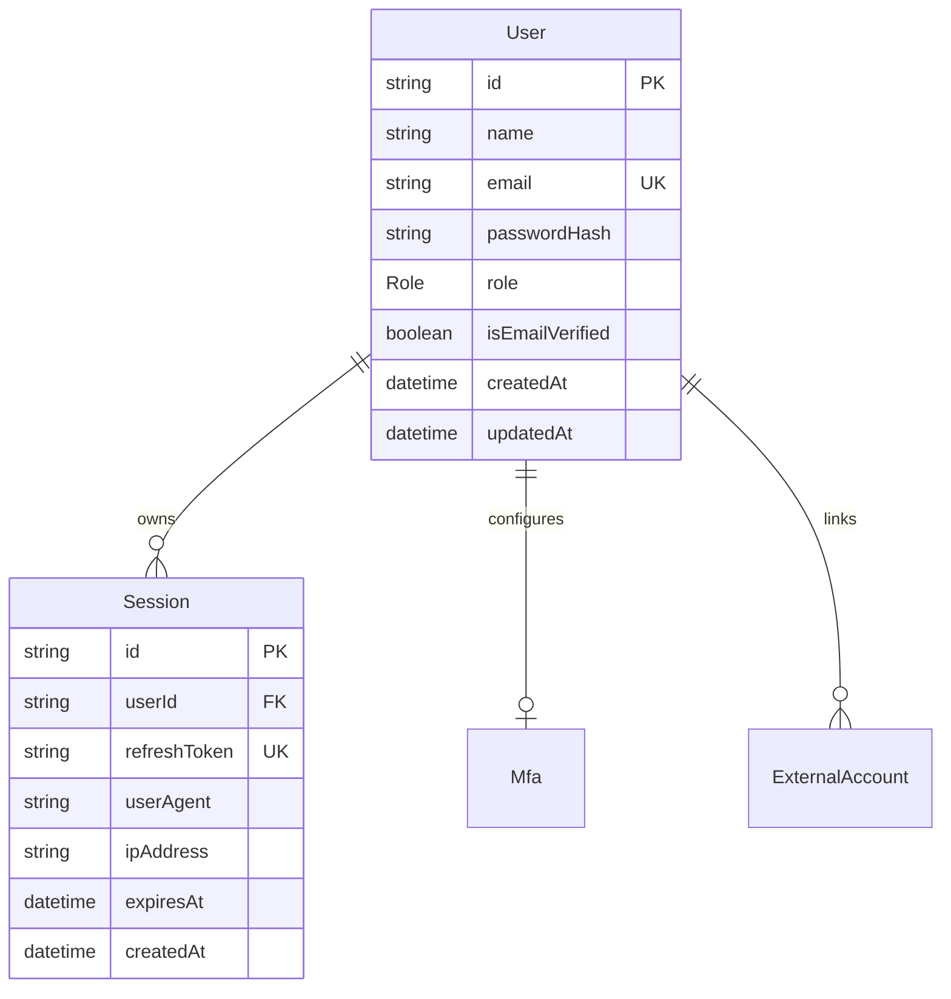

## Token Model

The backend creates purpose-specific JWTs:

| Token                    | Lifetime   | Where it is used                                                                 |
| ------------------------ | ---------- | -------------------------------------------------------------------------------- |
| Access token             | 15 minutes | Used to call protected API endpoints with `Authorization: Bearer <token>`.       |
| Refresh token            | 12 hours or 7 days | Used to rotate a session and create a new access token without logging in again. The longer lifetime applies only when the user selects "keep me signed in". |
| Email verification token | 24 hours   | Used only by email verification links.                                           |
| Password reset token     | 30 minutes | Used only by password reset links.                                               |

The access token payload includes:

- `sub`: user id
- `email`: user email
- `tokenType`: `access`
- `iat`: issued-at timestamp
- `exp`: expiry timestamp

The refresh token payload includes:

- `sub`: user id
- `tokenType`: `refresh`
- `iat`: issued-at timestamp
- `exp`: expiry timestamp

Email verification and password reset tokens include:

- `email`: user email
- `tokenType`: `emailVerification` or `passwordReset`
- `iat`: issued-at timestamp
- `exp`: expiry timestamp

This prevents a normal access or refresh token from being reused as an email verification or password reset token.

The backend signs and verifies these tokens in:

`erics-barber-api/src/modules/auth/infrastructure/services/jwt.service.ts`

## Registration Flow

Registration starts in the Next.js registration page.

Frontend files:

- `app/register/page.tsx`
- `app/register/form.tsx`
- `app/api/auth/register/route.ts`

Backend files:

- `auth.controller.ts`
- `register.use-case.ts`
- `auth.prisma-repository.ts`
- `bcrypt.service.ts`
- `jwt.service.ts`
- `resend.service.ts`

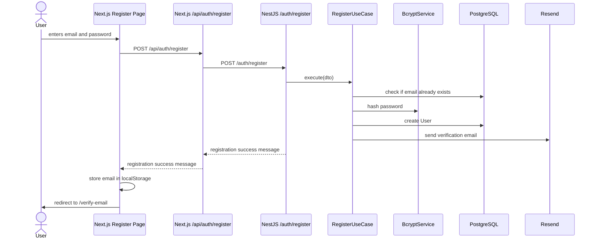

Step-by-step:

1. The user enters their email and password in `RegisterForm`.
2. `app/register/page.tsx` calls `POST /api/auth/register`.
3. The Next.js route forwards the request to `POST /auth/register`.
4. The NestJS API receives the registration request.
5. `RegisterUseCase` checks whether the email already exists.
6. The password is hashed with bcrypt.
7. A new `User` row is created in PostgreSQL.
8. The backend creates a verification token and sends a verification email through Resend.
9. The frontend stores the email in `localStorage` as `userEmail`.
10. The user is redirected to `/verify-email`.

Design decision:

The user is created before email verification, but `isEmailVerified` remains false. This allows the app to block login until the user proves they own the email address.

Trade-off:

This is a common approach, but it means the database may contain abandoned unverified users.

Current cleanup policy:

- unverified `CUSTOMER` accounts are removed by a scheduled backend job
- the job runs daily at 2am server time
- the default retention window is 7 days
- the window can be configured with `UNVERIFIED_USER_TTL_DAYS`
- admin/barber accounts are not targeted by this cleanup

Auth maintenance cleanup policy:

- expired refresh-token sessions are removed by a scheduled backend job
- expired MFA challenges are removed by the same job
- the job runs daily at 3am server time
- `Session.expiresAt` and `MfaChallenge.expiresAt` are indexed for cleanup

## Email Verification Flow

After registration, the user receives a verification link.

The backend creates the link in:

`auth.prisma-repository.ts`

The URL is built like this:

```text
CLIENT_BASE_URL/email-verify?token=<verification-token>
```

Frontend files:

- `app/verify-email/page.tsx`
- `app/email-verify/page.tsx`
- `app/api/auth/verify-email/route.ts`

Backend files:

- `auth.controller.ts`
- `verify-email.use-case.ts`
- `auth.prisma-repository.ts`
- `jwt.service.ts`

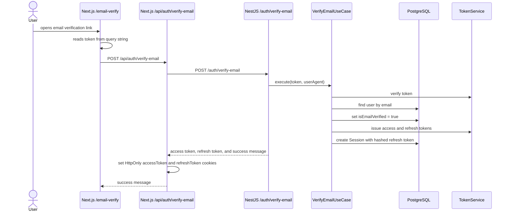

Step-by-step:

1. The user clicks the verification link from their email.
2. `app/email-verify/page.tsx` reads the `token` query parameter.
3. The page calls `POST /api/auth/verify-email`.
4. The NestJS backend verifies the token.
5. The backend finds the user by email.
6. The backend updates `User.isEmailVerified` to `true`.
7. The backend issues an access token and refresh token.
8. The refresh token is hashed and stored in the `Session` table.
9. The Next.js route stores both tokens as HttpOnly cookies on the UI domain.

## Resend Verification Email Flow

The `/verify-email` page allows the user to request another verification email.

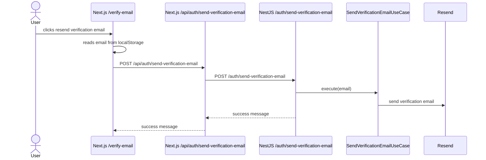

The resend page uses a 60-second timer to reduce repeated resend attempts from the UI.

## Login Flow

Login follows the same BFF pattern as registration and email verification. The browser calls a local Next.js API route, and that route calls the NestJS API:

`app/api/auth/login/route.ts`

This allows the Next.js app to store `accessToken` and `refreshToken` cookies on the frontend domain.

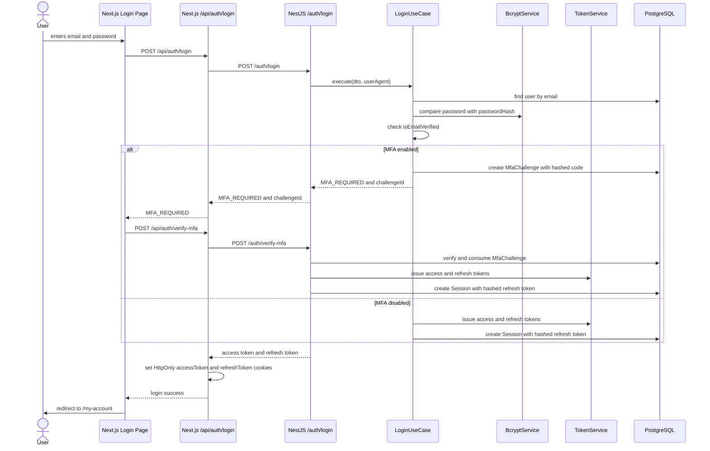

Step-by-step:

1. The user submits the login form, optionally selecting "keep me signed in".
2. `app/customer/login/page.tsx` sends `POST /api/auth/login` to the local Next.js app.
3. The Next.js route forwards the credentials and `rememberMe` value to the NestJS API at `/auth/login`.
4. `LoginUseCase` validates the email and password.
5. If the email is not verified, the backend rejects the login with `Email not verified`.
6. The Next.js login route normalizes that response to `code: EMAIL_NOT_VERIFIED`.
7. The login page stores the submitted email in `localStorage` as `userEmail` and redirects the user to `/verify-email`.
8. If the email is verified and MFA is disabled, the backend issues an access token and refresh token.
9. The refresh token is hashed and stored as a `Session` row with the selected `rememberMe` value.
10. The NestJS API returns the access token, refresh token, and `refreshMaxAgeSeconds` to the Next.js route.
11. The Next.js API route stores both tokens in HttpOnly cookies on the UI domain, using `refreshMaxAgeSeconds` for the refresh cookie.
12. The browser is redirected to `/my-account`.

If MFA is enabled:

1. Login returns `code: MFA_REQUIRED`, `challengeId`, and `mfaMethod`.
2. No access token, refresh token, or session is created yet.
3. The backend sends a short-lived email code and stores only the hashed code and selected `rememberMe` value in `MfaChallenge`.
4. The login page submits the code to `POST /api/auth/verify-mfa`.
5. The Next.js route forwards the challenge id and code to `POST /auth/verify-mfa`.
6. The backend verifies and consumes the challenge.
7. Only after MFA succeeds does the backend issue access/refresh tokens and create a refresh session using the stored `rememberMe` value.
8. The Next.js route sets both browser-facing auth cookies using the API-provided refresh lifetime.

MFA can be enabled or disabled for the current authenticated user through `PUT /auth/mfa-preference`. The only supported method today is `EMAIL`.

Cookies set by the Next.js login route:

```text
name: accessToken
httpOnly: true
secure: true in production
sameSite: lax
path: /
maxAge: 15 minutes

name: refreshToken
httpOnly: true
secure: true in production
sameSite: lax
path: /
maxAge: 12 hours by default, or 7 days when "keep me signed in" is selected
```

Design decision:

The browser-facing Next.js app stores the access token in an HttpOnly cookie instead of exposing it to client-side JavaScript. This is safer than putting the access token in `localStorage`.

Trade-off:

The app now has two authentication boundaries:

- the backend API owns real authentication and refresh sessions
- the Next.js app owns frontend-domain auth cookies for protected UI routes

This makes token handling more secure, but also more complex because cookies must be forwarded, cleared, and refreshed deliberately.

## Protected Page Flow

The `/my-account` page is protected by `proxy.ts`.

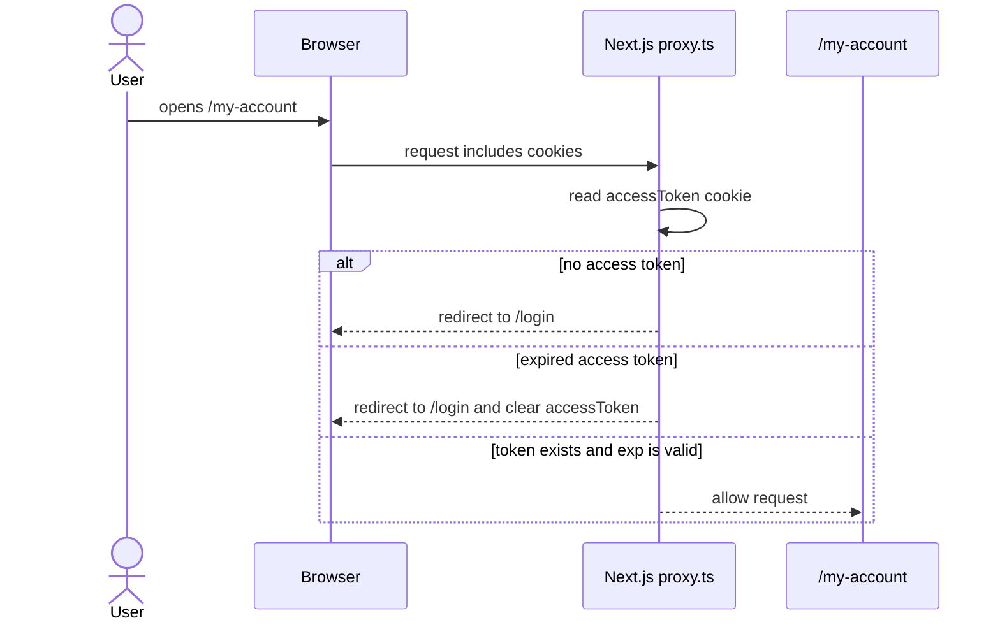

The proxy:

1. checks whether the request is for `/my-account`
2. reads the `accessToken` cookie
3. decodes the JWT payload
4. checks the `exp` timestamp
5. redirects to `/login` if the token is missing or expired

Important note:

The proxy only decodes the JWT to check expiry. It does not verify the token signature. That is acceptable for lightweight UI gating, but the backend must still verify the token before returning protected data.

The backend verification happens through `AuthGuard`.

## Protected API Flow

The Next.js profile route demonstrates how protected backend calls are made:

`app/api/auth/profile/route.ts`

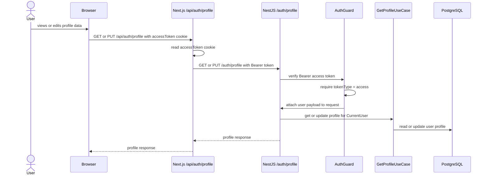

On the backend:

1. `AuthGuard` reads the `Authorization` header.
2. It requires a `Bearer` token.
3. It verifies the JWT through `TokenService.verifyToken`.
4. It requires `tokenType` to be `access`.
5. It attaches the decoded payload to `request.user`.
6. `@CurrentUser()` reads `request.user.sub` and passes the user id to the use case.

The current account page allows the user to edit their display name. Email is shown read-only because changing the login email should be handled by a separate verification flow.

## Logout Flow

Logout starts from:

`app/my-account/page.tsx`

The page calls:

`app/api/auth/logout/route.ts`

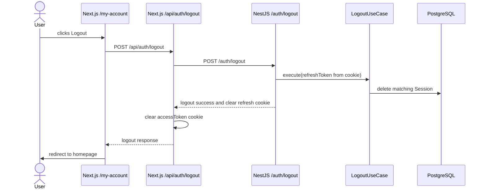

Intended behavior:

1. The user clicks logout.
2. The frontend calls the local Next.js logout route.
3. The Next.js route forwards the UI-domain `refreshToken` cookie to the NestJS `/auth/logout` endpoint when it is available.
4. The backend reads the refresh token cookie.
5. If the refresh token is present and valid, the backend invalidates the matching session in PostgreSQL.
6. The backend clears the refresh token cookie.
7. The Next.js route clears the frontend `accessToken` and `refreshToken` cookies.
8. The user is redirected to the homepage.

Current implementation note:

The NestJS logout endpoint is idempotent. Missing, malformed, wrong-type, expired, or already-revoked refresh tokens still produce a successful logout response after the API clears its refresh cookie.

The Next.js logout route also treats backend logout as best-effort. Even if the backend call fails, the UI still clears both local auth cookies and returns `Logged out`. The account page redirects to the homepage after a logout click.

## Account Deletion Flow

Account deletion starts from the account page danger zone and uses soft deletion plus anonymization.

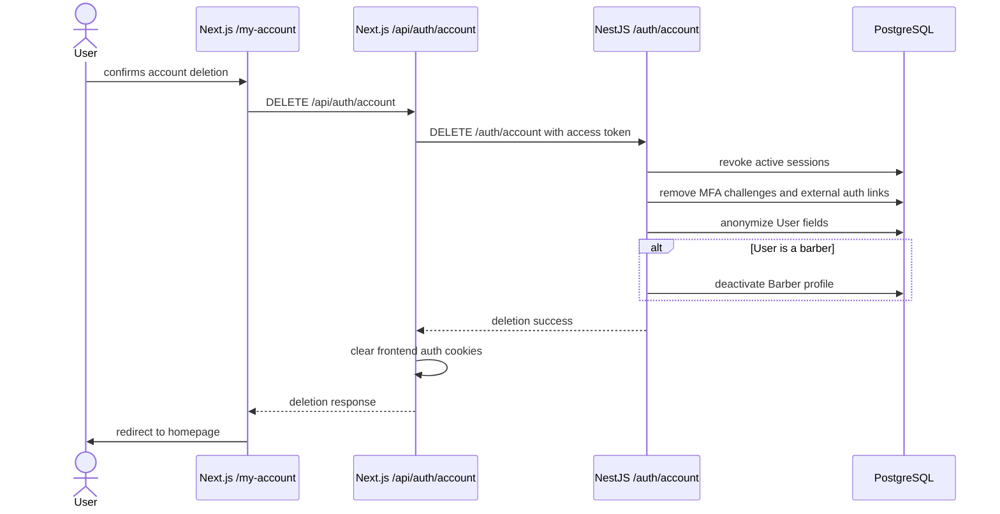

Deletion intentionally preserves historical bookings. Customer names and emails are not needed for barber accountability reports; the business needs booking facts such as barber id, date range, service, price, status, and count. This allows reports such as bookings completed in one week without retaining customer-identifying details.

## Refresh Token Flow

The backend has a refresh endpoint:

`POST /auth/refresh`

Backend files:

- `auth.controller.ts`
- `refresh-token.use-case.ts`
- `jwt.service.ts`
- `auth.prisma-repository.ts`

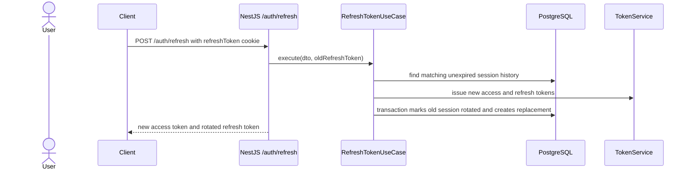

Intended behavior:

1. The client sends the refresh token cookie to the backend.
2. The backend checks that the refresh token maps to an unexpired stored session hash.
3. The backend creates a new access token and refresh token.
4. The backend hashes the new refresh token.
5. In one database transaction, the backend marks the old session as `ROTATED`, creates the new refresh-token session in the same `familyId`, and stores the replacement session id.
6. The backend sends the new access token and rotated refresh token back to the Next.js BFF.
7. The Next.js BFF updates both browser-facing cookies.

Current implementation note:

Refresh is wired into `proxy.ts` for protected page navigation and into `app/api/auth/profile/route.ts` for profile requests. If refresh fails, the BFF clears local auth cookies and redirects or returns `401`.

The session swap is atomic at the database level. If the new session cannot be created, the old session is not marked as rotated and the API does not return the new tokens.

Replay behavior:

- each login creates a session family
- each refresh keeps the replacement session in the same family
- rotated session rows remain in the database until they expire
- if an old rotated refresh token is submitted again, the API treats it as replay
- replay detection revokes active sessions in that session family and returns unauthorized

## Password Reset Flow

Password reset is exposed through the Next.js BFF and implemented by the NestJS API.

Frontend routes:

- `GET /forgot-password`
- `GET /reset-password?token=...`
- `POST /api/auth/reset-password-email`
- `POST /api/auth/reset-password`

Backend endpoints:

- `POST /auth/reset-password-email`
- `POST /auth/reset-password`

The intended flow is:

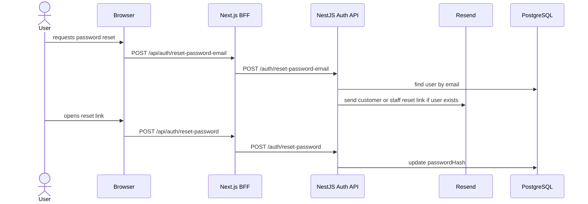

Design decision:

The reset email endpoint returns a generic success message even if the email does not exist. This avoids leaking whether a given email address is registered.

Staff reset links:

- customer reset requests send `surface: CUSTOMER`
- staff reset requests send `surface: STAFF`
- the API maps `CUSTOMER` to `CLIENT_BASE_URL`
- the API maps `STAFF` to `STAFF_CLIENT_BASE_URL`, falling back to `CLIENT_BASE_URL` if the staff URL is not configured

The UI and API pass a constrained surface value instead of a raw redirect URL. This keeps the staff experience polished without creating an open redirect primitive.

## Security Decisions

## Password Hashing

Passwords are never stored in plain text.

The backend uses bcrypt through:

`bcrypt.service.ts`

The current salt round value is `10`.

## Email Verification

Users cannot log in until `isEmailVerified` is true.

This check happens in:

`login.use-case.ts`

## HttpOnly Cookies

The frontend stores the access token as an HttpOnly cookie. This means client-side JavaScript cannot read the token directly, reducing the impact of XSS.

The backend also sets the refresh token as an HttpOnly cookie.

## Bearer Token API Protection

Protected backend routes use:

`AuthGuard`

The guard requires:

- an `Authorization` header
- a `Bearer` access token
- a valid JWT signature
- `tokenType` equal to `access`
- a `sub` value containing the user id

## Current Gaps and Follow-Up Work

These are useful notes for future development:

- Refresh token replay detection revokes the active sessions in a session family when an already-rotated refresh token is reused.
- Password reset is implemented through the BFF for both customer and staff login views.
- Expired sessions and MFA challenges are proactively cleaned up by a daily scheduled backend job.
- Role enforcement exists for booking endpoints, but unfinished modules such as barber/admin still need authorization wiring as they are built.
- Generated OpenAPI auth methods remain available in generated code; auth browser flows should continue to use the Next.js BFF route handlers instead.
- External provider login is feature-flagged but not implemented.

## Mental Model

The easiest way to understand the current authentication system is:

1. Registration creates a user with a hashed password and `isEmailVerified = false`.
2. Email verification marks the user as verified.
3. Login checks the password and email verification state.
4. The backend creates access and refresh tokens.
5. The backend stores a refresh-token session in PostgreSQL.
6. The Next.js app stores the access token in an HttpOnly cookie.
7. The Next.js proxy uses the access token cookie to protect frontend pages.
8. The backend uses `AuthGuard` to protect API routes.
9. Logout should clear the frontend access token and invalidate the backend refresh-token session.
