# Authentication Flows

This note explains how authentication works across the Eric's Barbers frontend and backend.

It covers:

- how the Next.js application handles login, registration, email verification, protected pages, and logout
- how the NestJS API implements authentication use cases
- how PostgreSQL stores users and sessions through Prisma
- current design decisions, trade-offs, and implementation gaps

Related note: [[Database Design]]

## High-Level Architecture

Authentication is split across three layers:

1. The Next.js frontend renders the user interface and handles browser-facing flows.
2. The NestJS backend owns the real authentication rules and token generation.
3. PostgreSQL stores users, password hashes, verification state, and refresh-token sessions.

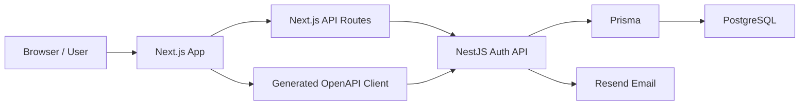

The project currently uses two different frontend request styles:

- some requests go through Next.js API routes, such as login, profile, and logout
- some requests go directly to the NestJS API through the generated OpenAPI client, such as register, verify email, and resend verification email

This split matters because cookies behave differently depending on whether the browser is talking to the Next.js app or directly to the backend API.

## Main Backend Auth Components

The backend auth module is wired in:

`erics-barber-api/src/modules/auth/auth.module.ts`

The main backend pieces are:

| File | Responsibility |
| --- | --- |
| `presentation/controllers/auth.controller.ts` | Defines the `/auth/*` HTTP endpoints. |
| `application/use-cases/register.use-case.ts` | Handles new user registration. |
| `application/use-cases/login.use-case.ts` | Validates login credentials and creates sessions. |
| `application/use-cases/verify-email.use-case.ts` | Verifies email tokens and activates users. |
| `application/use-cases/refresh-token.use-case.ts` | Rotates refresh tokens. |
| `application/use-cases/logout.use-case.ts` | Invalidates refresh-token sessions. |
| `infrastructure/prisma/auth.prisma-repository.ts` | Reads and writes users and sessions with Prisma. |
| `infrastructure/services/jwt.service.ts` | Signs, verifies, and decodes JWTs. |
| `infrastructure/services/bcrypt.service.ts` | Hashes passwords and compares hashed values. |
| `common/guards/auth.guard.ts` | Protects routes using Bearer access tokens. |

## Main Frontend Auth Components

The Next.js app is in:

`erics-barbers-ui`

The main frontend pieces are:

| File | Responsibility |
| --- | --- |
| `app/register/page.tsx` | Registration page. Calls `AuthRepository.registerUser`. |
| `app/register/form.tsx` | Registration form UI. |
| `app/verify-email/page.tsx` | Tells the user to check their email and allows resend. |
| `app/email-verify/page.tsx` | Reads the verification token from the URL and verifies the email. |
| `app/login/page.tsx` | Login page. Calls the local Next.js login route. |
| `app/login/form.tsx` | Login form UI. |
| `app/my-account/page.tsx` | Protected account page and logout action. |
| `app/api/auth/login/route.ts` | Next.js route that forwards login to NestJS and stores the access token cookie. |
| `app/api/auth/profile/route.ts` | Reads the access token cookie and forwards it to NestJS as a Bearer token. |
| `app/api/auth/logout/route.ts` | Calls NestJS logout and clears the frontend access token cookie. |
| `proxy.ts` | Protects `/my-account` by checking the access token cookie before rendering. |
| `api/repositories/auth-repository.ts` | Wrapper around generated OpenAPI auth methods. |
| `api/generated/services/AuthService.ts` | Generated client for backend auth endpoints. |

## Database Tables Used By Authentication

Authentication mainly uses these tables:

| Table | Purpose |
| --- | --- |
| `User` | Stores account identity, email, password hash, role, and email verification status. |
| `Session` | Stores refresh-token sessions for login, refresh, and logout. |
| `Mfa` | Future MFA support. |
| `ExternalAccount` | Future external/social login support. |

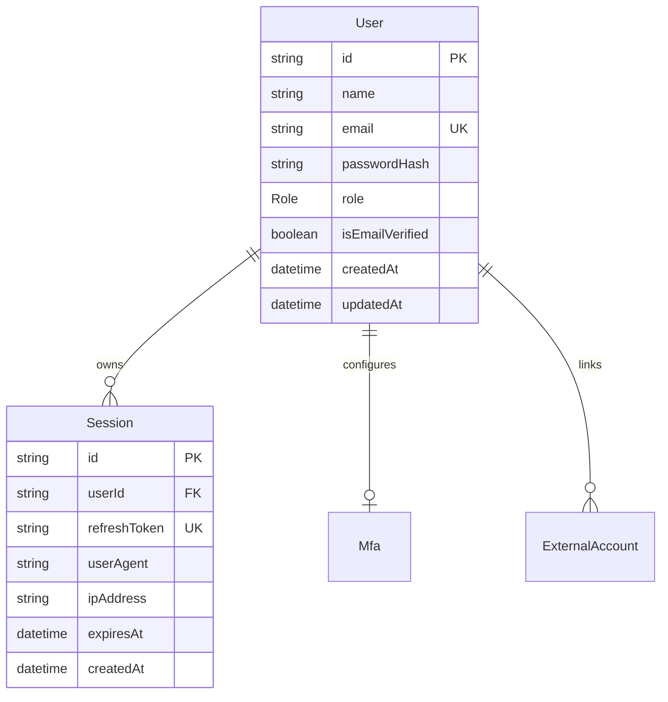

## Token Model

The backend creates two token types:

| Token | Lifetime | Where it is used |
| --- | --- | --- |
| Access token | 15 minutes | Used to call protected API endpoints with `Authorization: Bearer <token>`. |
| Refresh token | 7 days | Used to create a new access token without logging in again. |

The access token payload includes:

- `sub`: user id
- `email`: user email
- `tokenType`: `access`
- `iat`: issued-at timestamp
- `exp`: expiry timestamp

The refresh token payload includes:

- `sub`: user id
- `tokenType`: `refresh`
- `iat`: issued-at timestamp
- `exp`: expiry timestamp

The backend signs and verifies these tokens in:

`erics-barber-api/src/modules/auth/infrastructure/services/jwt.service.ts`

## Registration Flow

Registration starts in the Next.js registration page.

Frontend files:

- `app/register/page.tsx`
- `app/register/form.tsx`
- `api/repositories/auth-repository.ts`
- `api/generated/services/AuthService.ts`

Backend files:

- `auth.controller.ts`
- `register.use-case.ts`
- `auth.prisma-repository.ts`
- `bcrypt.service.ts`
- `jwt.service.ts`
- `resend.service.ts`

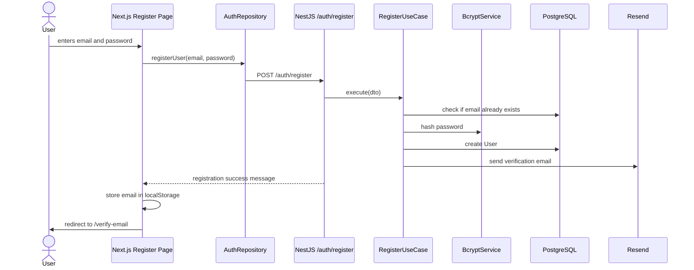

Step-by-step:

1. The user enters their email and password in `RegisterForm`.
2. `app/register/page.tsx` calls `AuthRepository.registerUser`.
3. `AuthRepository` calls the generated OpenAPI method `authControllerRegister`.
4. The NestJS API receives `POST /auth/register`.
5. `RegisterUseCase` checks whether the email already exists.
6. The password is hashed with bcrypt.
7. A new `User` row is created in PostgreSQL.
8. The backend creates a verification token and sends a verification email through Resend.
9. The frontend stores the email in `localStorage` as `userEmail`.
10. The user is redirected to `/verify-email`.

Design decision:

The user is created before email verification, but `isEmailVerified` remains false. This allows the app to block login until the user proves they own the email address.

Trade-off:

This is a common approach, but it means the database may contain unverified users. A production system may eventually need cleanup logic for accounts that never verify their email.

## Email Verification Flow

After registration, the user receives a verification link.

The backend creates the link in:

`auth.prisma-repository.ts`

The URL is built like this:

```text
CLIENT_BASE_URL/email-verify?token=<verification-token>
```

Frontend files:

- `app/verify-email/page.tsx`
- `app/email-verify/page.tsx`
- `api/repositories/auth-repository.ts`

Backend files:

- `auth.controller.ts`
- `verify-email.use-case.ts`
- `auth.prisma-repository.ts`
- `jwt.service.ts`

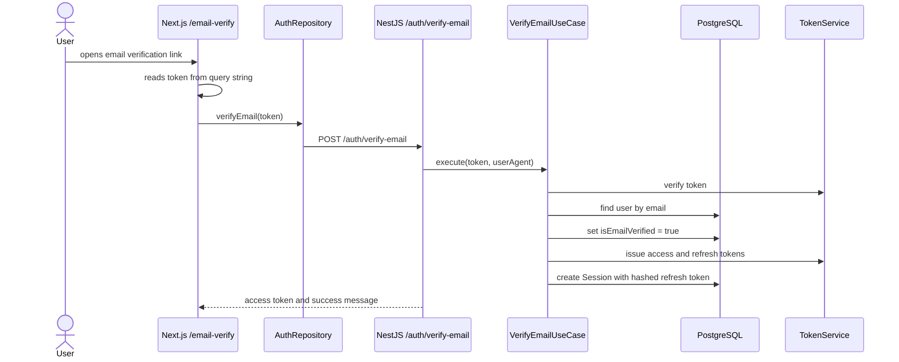

Step-by-step:

1. The user clicks the verification link from their email.
2. `app/email-verify/page.tsx` reads the `token` query parameter.
3. The page calls `AuthRepository.verifyEmail(token)`.
4. The NestJS backend verifies the token.
5. The backend finds the user by email.
6. The backend updates `User.isEmailVerified` to `true`.
7. The backend issues an access token and refresh token.
8. The refresh token is hashed and stored in the `Session` table.
9. The backend sets a `refreshToken` cookie and returns the access token.

Current implementation note:

The email verification page calls the backend directly through the generated OpenAPI client. The backend returns an access token, but the current frontend page does not store that access token in the same `accessToken` cookie used by the login flow. That means email verification succeeds, but the user may still need to log in afterwards for the Next.js protected routes to recognize them.

## Resend Verification Email Flow

The `/verify-email` page allows the user to request another verification email.

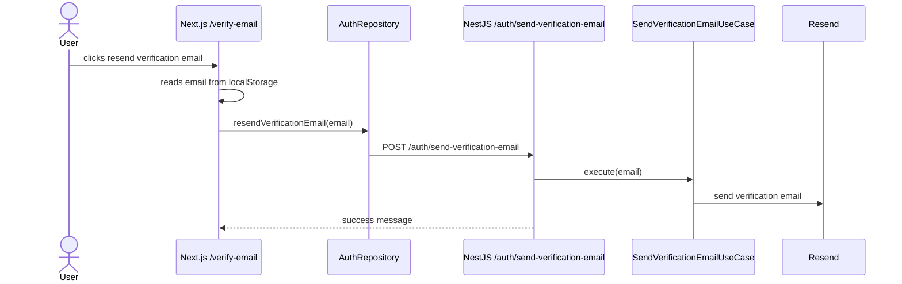

The resend page uses a 60-second timer to reduce repeated resend attempts from the UI.

## Login Flow

Login uses a different frontend path from registration.

Instead of calling the generated OpenAPI client directly, the login page calls a local Next.js API route:

`app/api/auth/login/route.ts`

This allows the Next.js app to store an `accessToken` cookie on the frontend domain.

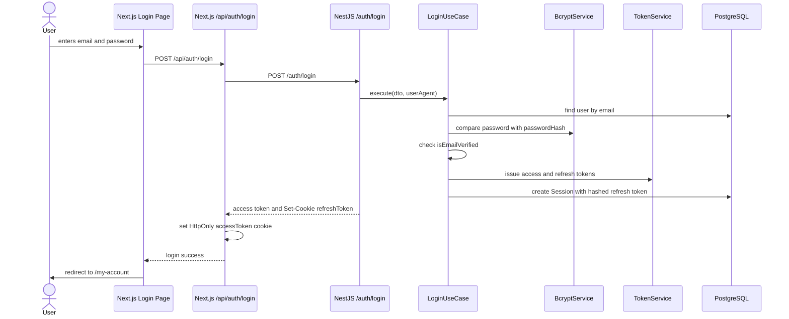

Step-by-step:

1. The user submits the login form.
2. `app/login/page.tsx` sends `POST /api/auth/login` to the local Next.js app.
3. The Next.js route forwards the credentials to the NestJS API at `/auth/login`.
4. `LoginUseCase` validates the email and password.
5. The backend rejects the login if the email is not verified.
6. The backend issues an access token and refresh token.
7. The refresh token is hashed and stored as a `Session` row.
8. The NestJS API sets a `refreshToken` cookie.
9. The Next.js API route stores the returned access token in an HttpOnly `accessToken` cookie on the UI domain.
10. The browser is redirected to `/my-account`.

Cookie set by the Next.js login route:

```text
name: accessToken
httpOnly: true
secure: true
sameSite: lax
path: /
maxAge: 15 minutes
```

Cookie set by the NestJS backend:

```text
name: refreshToken
httpOnly: true
secure: true
sameSite: none
path: /auth
maxAge: 7 days
```

Design decision:

The browser-facing Next.js app stores the access token in an HttpOnly cookie instead of exposing it to client-side JavaScript. This is safer than putting the access token in `localStorage`.

Trade-off:

The app now has two authentication boundaries:

- the backend API owns real authentication and sessions
- the Next.js app owns a frontend-domain `accessToken` cookie for protected UI routes

This makes token handling more secure, but also more complex because cookies must be forwarded, cleared, and refreshed deliberately.

## Protected Page Flow

The `/my-account` page is protected by `proxy.ts`.

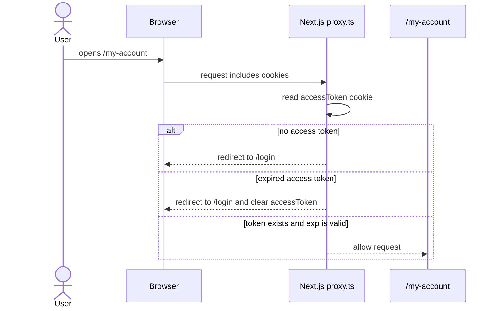

The proxy:

1. checks whether the request is for `/my-account`
2. reads the `accessToken` cookie
3. decodes the JWT payload
4. checks the `exp` timestamp
5. redirects to `/login` if the token is missing or expired

Important note:

The proxy only decodes the JWT to check expiry. It does not verify the token signature. That is acceptable for lightweight UI gating, but the backend must still verify the token before returning protected data.

The backend verification happens through `AuthGuard`.

## Protected API Flow

The Next.js profile route demonstrates how protected backend calls are made:

`app/api/auth/profile/route.ts`

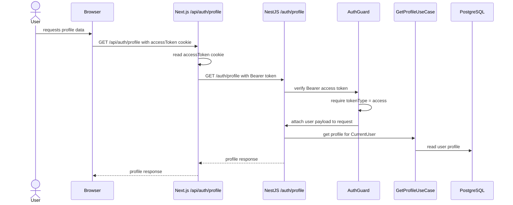

On the backend:

1. `AuthGuard` reads the `Authorization` header.
2. It requires a `Bearer` token.
3. It verifies the JWT through `TokenService.verifyToken`.
4. It requires `tokenType` to be `access`.
5. It attaches the decoded payload to `request.user`.
6. `@CurrentUser()` reads `request.user.sub` and passes the user id to the use case.

## Logout Flow

Logout starts from:

`app/my-account/page.tsx`

The page calls:

`app/api/auth/logout/route.ts`

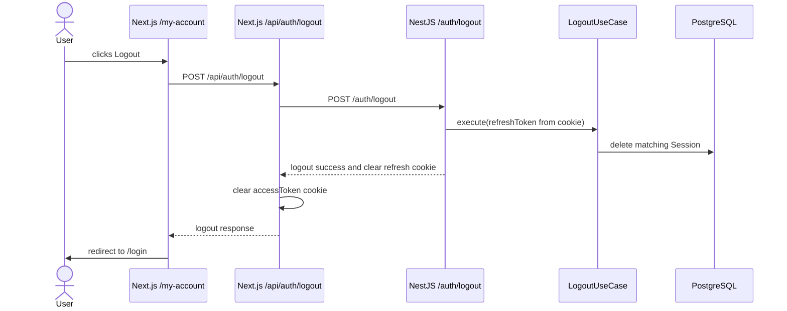

Intended behavior:

1. The user clicks logout.
2. The frontend calls the local Next.js logout route.
3. The Next.js route calls the NestJS `/auth/logout` endpoint.
4. The backend reads the refresh token cookie.
5. The backend invalidates the matching session in PostgreSQL.
6. The backend clears the refresh token cookie.
7. The Next.js route clears the frontend `accessToken` cookie.
8. The user is redirected to `/login`.

Current implementation note:

The Next.js logout route calls the backend without explicitly forwarding the backend `refreshToken` cookie. If the backend refresh cookie is not available on that request, the backend may not be able to invalidate the stored session. The frontend still clears the `accessToken` cookie.

Also, the logout route currently returns the message `Logged in`, which should probably become `Logged out`.

## Refresh Token Flow

The backend has a refresh endpoint:

`POST /auth/refresh`

Backend files:

- `auth.controller.ts`
- `refresh-token.use-case.ts`
- `jwt.service.ts`
- `auth.prisma-repository.ts`

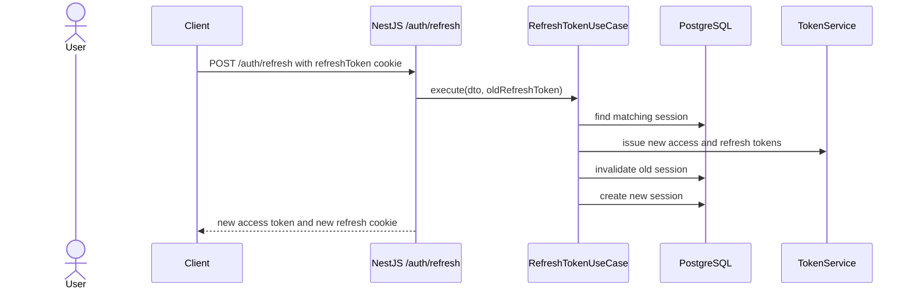

Intended behavior:

1. The client sends the refresh token cookie to the backend.
2. The backend checks that the refresh token maps to a valid session.
3. The backend invalidates the old refresh token.
4. The backend creates a new access token and refresh token.
5. The backend stores the new refresh-token session.
6. The backend sends the new access token back to the client and updates the refresh cookie.

Current implementation note:

The backend has a refresh use case, but the Next.js frontend does not appear to have a completed local refresh route yet. At the moment, protected frontend routing mainly relies on the 15-minute `accessToken` cookie.

## Password Reset Flow

The backend also contains password reset endpoints:

- `POST /auth/reset-password-email`
- `POST /auth/reset-password`

The intended flow is:

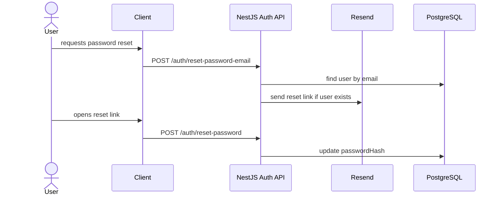

Design decision:

The reset email endpoint returns a generic success message even if the email does not exist. This avoids leaking whether a given email address is registered.

## Security Decisions

## Password Hashing

Passwords are never stored in plain text.

The backend uses bcrypt through:

`bcrypt.service.ts`

The current salt round value is `10`.

## Email Verification

Users cannot log in until `isEmailVerified` is true.

This check happens in:

`login.use-case.ts`

## HttpOnly Cookies

The frontend stores the access token as an HttpOnly cookie. This means client-side JavaScript cannot read the token directly, reducing the impact of XSS.

The backend also sets the refresh token as an HttpOnly cookie.

## Bearer Token API Protection

Protected backend routes use:

`AuthGuard`

The guard requires:

- an `Authorization` header
- a `Bearer` access token
- a valid JWT signature
- `tokenType` equal to `access`
- a `sub` value containing the user id

## Current Gaps and Follow-Up Work

These are useful notes for future development:

- The frontend has mixed auth request paths: generated OpenAPI client for some flows, Next.js API routes for others.
- Email verification returns an access token, but the current frontend does not store it in the `accessToken` cookie.
- The Next.js logout route should forward the backend refresh cookie if the backend is expected to invalidate the session.
- The Next.js logout route currently returns `Logged in` instead of `Logged out`.
- The refresh endpoint exists in the backend, but the frontend does not yet have a complete refresh-token flow.
- The generated OpenAPI client has `WITH_CREDENTIALS` set to `false`, so direct browser calls may not include or receive cookies as intended.
- Cookies use `secure: true`, which means they require HTTPS. This is good for production, but local development may need special handling.
- Role metadata exists through `@Roles(...)`, but role enforcement depends on a roles guard being implemented and applied.
- Refresh-token lookup and invalidation should be reviewed carefully because bcrypt hashes are salted. Re-hashing the same token will not produce the same stored value.

## Mental Model

The easiest way to understand the current authentication system is:

1. Registration creates a user with a hashed password and `isEmailVerified = false`.
2. Email verification marks the user as verified.
3. Login checks the password and email verification state.
4. The backend creates access and refresh tokens.
5. The backend stores a refresh-token session in PostgreSQL.
6. The Next.js app stores the access token in an HttpOnly cookie.
7. The Next.js proxy uses the access token cookie to protect frontend pages.
8. The backend uses `AuthGuard` to protect API routes.
9. Logout should clear the frontend access token and invalidate the backend refresh-token session.

