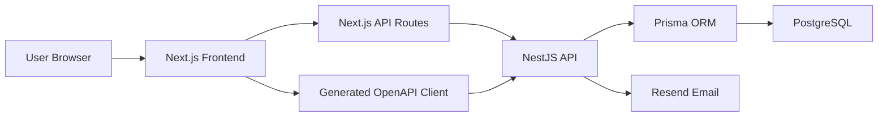
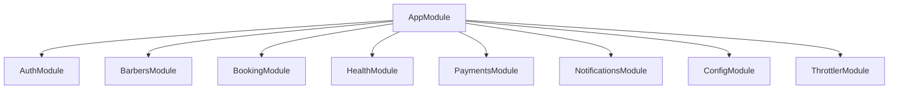
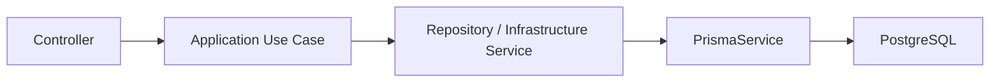
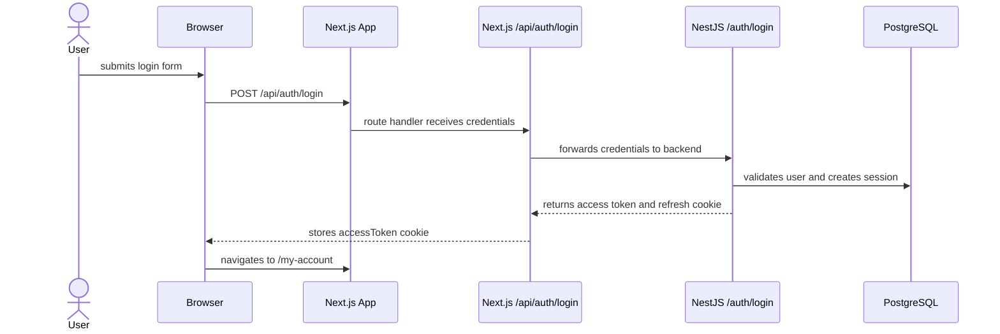

# Current System Architecture

Status: current-state architecture for the partially implemented application.

This note explains how the current Eric's Barbers system is structured across the frontend, backend, database, and external services.

Related notes:

- [[Project Overview]]
- [[Authentication Flows]]
- [[Database Design]]
- [[Local Development Setup]]
- [[Known Gaps and Roadmap]]

## System Context

The project currently contains multiple app folders:

| Folder | Purpose | Current status |
| --- | --- | --- |
| `erics-barbers-ui` | Main Next.js frontend | Active frontend |
| `erics-barber-api` | NestJS backend API | Active backend |
| `erics-barbers-ui-react` | Older Vite React app | Appears to be a starter or earlier experiment |
| `Eric's Barbers` | Obsidian documentation vault | Active documentation |

The active application is the Next.js frontend plus the NestJS backend.



## Frontend Architecture

The frontend lives in:

`erics-barbers-ui`

It is a Next.js app using the app directory.

Main folders:

| Path | Purpose |
| --- | --- |
| `app/` | Next.js routes, pages, layouts, and route handlers. |
| `app/components/` | Shared UI components. |
| `app/api/` | Next.js API routes used as a server-side boundary for selected auth flows. |
| `api/repositories/` | Repository wrappers around generated API clients. |
| `api/generated/` | Generated OpenAPI client code. |
| `test/` | Frontend tests. |

## Frontend Routing

Important routes:

| Route | File | Status |
| --- | --- | --- |
| `/` | `app/page.tsx` | Implemented landing/home page. |
| `/register` | `app/register/page.tsx` | Implemented. |
| `/verify-email` | `app/verify-email/page.tsx` | Implemented. |
| `/email-verify` | `app/email-verify/page.tsx` | Implemented. |
| `/login` | `app/login/page.tsx` | Implemented. |
| `/my-account` | `app/my-account/page.tsx` | Minimal protected page. |
| `/services` | `app/services/page.tsx` | Static services table. |
| `/bookings` | `app/bookings/page.tsx` | Feature-flagged placeholder. |
| `/bookings/new-booking` | `app/bookings/new-booking/page.tsx` | Placeholder. |
| `/bookings/manage-booking` | `app/bookings/manage-booking/page.tsx` | Placeholder. |

## Frontend API Strategy

The frontend currently uses two API access patterns.

Pattern 1: direct generated OpenAPI client.

Used by:

- registration
- email verification
- resend verification email
- reset password helper methods

Files:

- `api/repositories/auth-repository.ts`
- `api/generated/services/AuthService.ts`
- `api/generated/core/OpenAPI.ts`

Pattern 2: Next.js API routes as a frontend auth boundary.

Used by:

- login
- profile
- logout

Files:

- `app/api/auth/login/route.ts`
- `app/api/auth/profile/route.ts`
- `app/api/auth/logout/route.ts`

Reason for this pattern:

Next.js route handlers can read and set HttpOnly cookies for the frontend domain. This is useful for storing the `accessToken` cookie without exposing it to client-side JavaScript.

Trade-off:

Using both patterns makes the system harder to reason about. Long term, the project should decide whether all auth flows go through Next.js API routes or whether direct generated-client calls are enough for non-cookie flows.

## Backend Architecture

The backend lives in:

`erics-barber-api`

It is a NestJS API organized by feature modules.

Main folders:

| Path | Purpose |
| --- | --- |
| `src/app.module.ts` | Root NestJS module. |
| `src/main.ts` | Application bootstrap, Swagger, CORS, middleware, and server startup. |
| `src/common/` | Shared guards, decorators, constants, and types. |
| `src/config/` | Configuration module and service. |
| `src/infrastructure/` | Shared infrastructure such as Prisma, mail, and payment services. |
| `src/modules/` | Feature modules. |
| `src/generated/prisma/` | Generated Prisma client and model types. |
| `prisma/` | Prisma schema and migrations. |
| `test/` | End-to-end tests. |

## Backend Modules

The root module imports:

- `AuthModule`
- `BarbersModule`
- `BookingModule`
- `ConfigModule`
- `HealthModule`
- `PaymentsModule`
- `NotificationsModule`
- `ThrottlerModule`



## Backend Layering Pattern

The main feature modules are organized in a clean-architecture-inspired style:

```text
module/
  presentation/      controllers and DTOs
  application/       use cases
  infrastructure/    Prisma repositories and external services
  domain/            domain entities, where present
```

The intended request flow is:



Trade-off:

This keeps controllers thin and separates business workflows from HTTP concerns. However, the current code does not fully use dependency inversion. Use cases often inject concrete infrastructure classes directly rather than interfaces from `application/ports`.

## Authentication Architecture

Authentication is currently the most complete feature.

Important backend files:

- `src/modules/auth/presentation/controllers/auth.controller.ts`
- `src/modules/auth/application/use-cases/register.use-case.ts`
- `src/modules/auth/application/use-cases/login.use-case.ts`
- `src/modules/auth/application/use-cases/verify-email.use-case.ts`
- `src/modules/auth/application/use-cases/logout.use-case.ts`
- `src/modules/auth/application/use-cases/refresh-token.use-case.ts`
- `src/modules/auth/infrastructure/prisma/auth.prisma-repository.ts`
- `src/modules/auth/infrastructure/services/jwt.service.ts`
- `src/modules/auth/infrastructure/services/bcrypt.service.ts`
- `src/common/guards/auth.guard.ts`

The detailed auth design is documented in [[Authentication Flows]].

## Database Architecture

The backend uses Prisma with PostgreSQL.

Important files:

- `prisma/schema.prisma`
- `prisma/migrations/`
- `prisma.config.ts`
- `src/infrastructure/prisma/prisma.service.ts`
- `src/generated/prisma/`

Prisma is configured to generate the client into:

`src/generated/prisma`

The main database entities are:

- `User`
- `Session`
- `Booking`
- `Barber`
- `ExternalAccount`
- `Mfa`

The detailed database design is documented in [[Database Design]].

## External Services

## Resend

Resend is used for transactional email.

Current uses:

- email verification
- password reset email foundation

Files:

- `src/infrastructure/mail/resend.service.ts`
- `src/modules/auth/infrastructure/prisma/auth.prisma-repository.ts`

## Render

The backend Swagger config references a deployed API URL:

`https://erics-barber-api.onrender.com`

The repository also contains a `Procfile`, which suggests Render-style deployment support.

## Runtime Ports

Current local runtime assumptions:

| App | Default port |
| --- | --- |
| Next.js frontend | `3000` |
| NestJS backend | `4000` |
| Swagger docs | `4000/api` |

## Request Flow Example

Login is a good example of the current system architecture:



## Current Architectural Trade-Offs

- The codebase has a clear modular direction, but some modules are still placeholders.
- The backend uses use cases, which improves readability, but some use cases are thin wrappers.
- The frontend uses both direct OpenAPI client calls and Next.js API routes.
- JWT access tokens are stored as HttpOnly cookies on the frontend domain, improving safety but increasing cookie-handling complexity.
- Refresh-token sessions are stored in PostgreSQL, which supports logout and invalidation but requires careful implementation.
- Booking and barber modules exist before the product flows are complete.

## Architecture Principles To Maintain

As the project grows, it should preserve these principles:

1. Keep controllers thin.
2. Put business workflows in use cases.
3. Keep database access behind repositories or services.
4. Keep frontend pages focused on user flows.
5. Keep auth-sensitive cookie handling on the server side.
6. Mark unfinished features clearly in both code and docs.
7. Avoid duplicating domain rules between frontend and backend.

