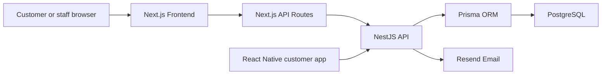
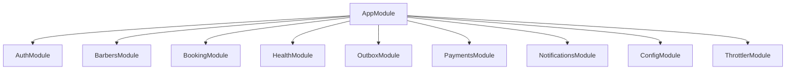
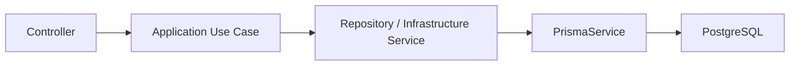
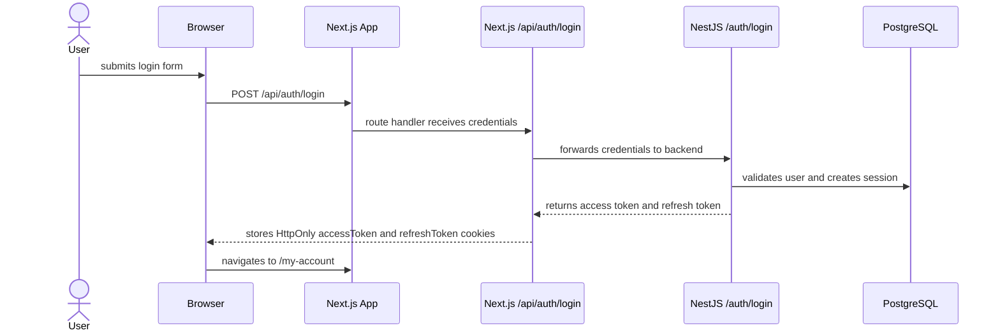

# Current System Architecture

Status: current-state architecture for the partially implemented application.

This note explains how the current Eric's Barbers system is structured across its web client, mobile scaffold, backend, database, and external services. Planned mobile contracts are marked explicitly and are not presented as implemented.

Related notes:

- [[Project Overview]]
- [[Authentication Flows]]
- [[Database Design]]
- [[Local Development Setup]]
- [[Known Gaps and Roadmap]]
- [[Shared Product Requirements]]
- [[Web App Delivery Roadmap]]
- [[Mobile App Requirements]]
- [[Mobile App Delivery Roadmap]]

## System Context

The workspace contains four active, independently versioned repositories plus organization metadata:

| Repository | Purpose | Current status |
| --- | --- | --- |
| `erics-barbers-ui` | Next.js customer/staff web client and browser BFF | Active |
| `erics-barber-api` | Shared NestJS API and canonical OpenAPI contract | Active |
| `erics-barbers-app` | React Native and Expo customer application | Native scaffold exists; Mobile 1.0 features are being delivered |
| `erics-barbers-docs` | Requirements, roadmaps, current-state notes, and ADRs | Active |
| `.github` | GitHub organization profile metadata | Active |



The browser path is implemented. The mobile-to-API path is the accepted architecture; its native authentication transport and feature integrations remain delivery work.

## Web Architecture

The web client lives in:

`erics-barbers-ui`

It is a Next.js app using the app directory.

Main folders:

| Path              | Purpose                                                                     |
| ----------------- | --------------------------------------------------------------------------- |
| `app/`            | Next.js routes, pages, layouts, and route handlers.                         |
| `app/components/` | Shared UI components.                                                       |
| `app/api/`        | Next.js API routes used as the server-side boundary for browser auth flows. |
| `api/generated/`  | Generated OpenAPI client code.                                              |
| `test/`           | Frontend tests.                                                             |

## Web Routing

Important routes:

| Route                      | File                                   | Status                          |
| -------------------------- | -------------------------------------- | ------------------------------- |
| `/`                        | `app/page.tsx`                         | Implemented landing/home page.  |
| `/register`                | `app/register/page.tsx`                | Implemented.                    |
| `/verify-email`            | `app/verify-email/page.tsx`            | Implemented.                    |
| `/email-verify`            | `app/email-verify/page.tsx`            | Implemented.                    |
| `/login`                   | `app/login/page.tsx`                   | Implemented.                    |
| `/my-account`              | `app/my-account/page.tsx`              | Protected account/profile page. |
| `/services`                | `app/services/page.tsx`                | Database-backed services table. |
| `/bookings`                | `app/bookings/page.tsx`                | Feature-flagged placeholder.    |
| `/bookings/new-booking`    | `app/bookings/new-booking/page.tsx`    | Placeholder.                    |
| `/bookings/manage-booking` | `app/bookings/manage-booking/page.tsx` | Placeholder.                    |

## Web API Strategy

Browser-facing authentication uses Next.js API routes as a BFF boundary.

Used by:

- registration
- login
- email verification
- resend verification email
- profile
- logout

Files:

- `app/api/auth/register/route.ts`
- `app/api/auth/login/route.ts`
- `app/api/auth/verify-email/route.ts`
- `app/api/auth/send-verification-email/route.ts`
- `app/api/auth/profile/route.ts`
- `app/api/auth/logout/route.ts`

Reason for this pattern:

Next.js route handlers can read and set HttpOnly cookies for the frontend domain. This is useful for storing `accessToken` and `refreshToken` cookies without exposing them to client-side JavaScript.

Trade-off:

The generated OpenAPI client remains available and can be useful for non-auth backend resources, but auth browser flows should continue to use the BFF routes because they involve cookie setting, refresh retry behavior, redirects, and local logout cleanup.

## Mobile Architecture

The native customer client lives in:

`erics-barbers-app`

The current repository contains an Expo Router scaffold, Expo application configuration, assets, and the mobile UX journey design. It targets iOS and Android with React Native and Expo.

Accepted boundaries from [[ADR 0022 - Build A Customer Mobile App With React Native And Expo]]:

- use Expo Continuous Native Generation;
- keep generated `ios` and `android` projects out of source control initially;
- express native behavior through Expo configuration and config plugins;
- communicate directly with NestJS rather than the Next.js BFF;
- limit Mobile 1.0 to customer and guest journeys;
- use TanStack Query for server state, React/form state for transient state, SecureStore for sensitive durable credentials, and memory for the access token and active session; and
- route relevant verification, reset, and booking links through universal/app links with web fallback.

Native login, refresh, logout, secure-storage, and session-restoration behavior are not yet current-state capabilities. They must be implemented against an explicit native contract; the API must not infer client type from User-Agent or other incidental headers.

## Backend Architecture

The backend lives in:

`erics-barber-api`

It is a NestJS API organized by feature modules.

Main folders:

| Path                    | Purpose                                                               |
| ----------------------- | --------------------------------------------------------------------- |
| `src/app.module.ts`     | Root NestJS module.                                                   |
| `src/main.ts`           | Application bootstrap, Swagger, CORS, middleware, and server startup. |
| `src/common/`           | Shared guards, decorators, constants, and types.                      |
| `src/config/`           | Configuration module and service.                                     |
| `src/infrastructure/`   | Shared infrastructure such as Prisma, mail, and payment services.     |
| `src/modules/`          | Feature modules.                                                      |
| `src/generated/prisma/` | Generated Prisma client and model types.                              |
| `prisma/`               | Prisma schema and migrations.                                         |
| `test/`                 | End-to-end tests.                                                     |

## Backend Modules

Current backend modules include auth, barbers, booking, health, notifications, payments, and services. The services module exposes the active service catalog from the database so booking flows can use service price, duration, and description data.

The root module imports:

- `AuthModule`
- `BarbersModule`
- `BookingModule`
- `ConfigModule`
- `HealthModule`
- `OutboxModule`
- `PaymentsModule`
- `NotificationsModule`
- `ThrottlerModule`



## Shared API Contract

The API repository owns `openapi/openapi.json` as the canonical client contract. Runtime Swagger UI and the committed document use the same NestJS document factory.

The web repository consumes a synchronized copy at `api/api-spec.json`. The mobile repository will consume the same API-owned contract when generated mobile API integration is introduced. Neither client should independently hand-edit its copy.

The API provides `npm run openapi:generate` and `npm run openapi:check`. A local pre-commit hook runs the check, while CI remains the authoritative shared enforcement point because local hooks can be skipped.

## Backend Layering Pattern

The main feature modules are organized in a clean-architecture-inspired style:

```text
module/
  presentation/      controllers and DTOs
  application/       use cases
  infrastructure/    Prisma repositories and external services
  domain/            domain entities, where present
```

The intended request flow is:



Trade-off:

This keeps controllers thin and separates business workflows from HTTP concerns. However, the current code does not fully use dependency inversion. Use cases often inject concrete infrastructure classes directly rather than interfaces from `application/ports`.

## API Request Validation

The backend uses a strict global NestJS `ValidationPipe` configured in:

`erics-barber-api/src/config/validation.ts`

Current behavior:

- transforms request bodies and query strings into DTO instances
- rejects properties that are not explicitly decorated on the DTO
- converts decorated primitive values such as query `page` and `limit`
- hides submitted values from validation error responses

This makes DTOs the public request contract. When a new request field is added, it should also get an explicit validation decorator.

## Authentication Architecture

Authentication is currently the most complete feature.

Important backend files:

- `src/modules/auth/presentation/controllers/auth.controller.ts`
- `src/modules/auth/application/use-cases/register.use-case.ts`
- `src/modules/auth/application/use-cases/login.use-case.ts`
- `src/modules/auth/application/use-cases/verify-email.use-case.ts`
- `src/modules/auth/application/use-cases/logout.use-case.ts`
- `src/modules/auth/application/use-cases/refresh-token.use-case.ts`
- `src/modules/auth/infrastructure/prisma/auth.prisma-repository.ts`
- `src/modules/auth/infrastructure/services/jwt.service.ts`
- `src/modules/auth/infrastructure/services/bcrypt.service.ts`
- `src/common/guards/auth.guard.ts`

The detailed auth design is documented in [[Authentication Flows]].

MFA is implemented as an email-code challenge after successful password validation. MFA-enabled users receive `MFA_REQUIRED` from login, complete `POST /auth/verify-mfa`, and only then receive access/refresh tokens.

External provider login is not implemented. The schema keeps `ExternalAccount` for future provider identities, and provider UI/API work should stay behind the external-provider feature flag.

## Database Architecture

The backend uses Prisma with PostgreSQL.

Important files:

- `prisma/schema.prisma`
- `prisma/migrations/`
- `prisma.config.ts`
- `src/infrastructure/prisma/prisma.service.ts`
- `src/generated/prisma/`

Prisma is configured to generate the client into:

`src/generated/prisma`

The main database entities are:

- `User`
- `Session`
- `MfaChallenge`
- `Booking`
- `OutboxEvent`
- `Barber`
- `ExternalAccount`
- `Mfa`

The detailed database design is documented in [[Database Design]].

## External Services

## Resend

Resend is used for transactional email.

Current uses:

- email verification through the email outbox processor
- password reset email through the email outbox processor
- MFA login codes through the email outbox processor
- booking confirmation, update, and cancellation emails through the email outbox processor

Files:

- `src/infrastructure/mail/resend.service.ts`
- `src/infrastructure/outbox/email-outbox.processor.ts`
- `src/modules/auth/infrastructure/prisma/auth.prisma-repository.ts`

## Render

The backend Swagger config references a deployed API URL:

`https://erics-barber-api.onrender.com`

The repository also contains a `Procfile`, which suggests Render-style deployment support.

## Runtime Ports

Current local runtime assumptions:

| App              | Default port |
| ---------------- | ------------ |
| Next.js frontend | `3000`       |
| NestJS backend   | `4000`       |
| Swagger docs     | `4000/api`   |
| Expo Metro       | `8081`       |

## Request Flow Example

Login is a good example of the current system architecture:



## Current Architectural Trade-Offs

- The codebase has a clear modular direction, but some modules are still placeholders.
- The backend uses use cases, which improves readability, but some use cases are thin wrappers.
- Browser-facing auth goes through Next.js BFF route handlers.
- The native application will call NestJS directly through a separately defined token transport.
- JWT access tokens are stored as HttpOnly cookies on the frontend domain, improving safety but increasing cookie-handling complexity.
- Refresh tokens are stored as HttpOnly cookies on the frontend domain and as hashed sessions in PostgreSQL.
- Web and mobile share business behavior and an API-owned OpenAPI contract, but maintain separate presentation and authentication-transport layers.
- Booking and barber modules exist before the product flows are complete.

## Architecture Principles To Maintain

As the project grows, it should preserve these principles:

1. Keep controllers thin.
2. Put business workflows in use cases.
3. Keep database access behind repositories or services.
4. Keep web pages and mobile screens focused on their user journeys.
5. Keep browser auth-sensitive cookie handling in the Next.js BFF.
6. Use explicit native authentication contracts and secure storage on mobile.
7. Enforce shared business rules in NestJS rather than duplicating them across clients.
8. Generate client contracts from the API-owned OpenAPI document.
9. Mark unfinished features clearly in both code and docs.
