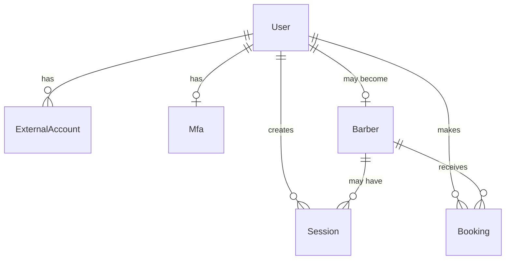
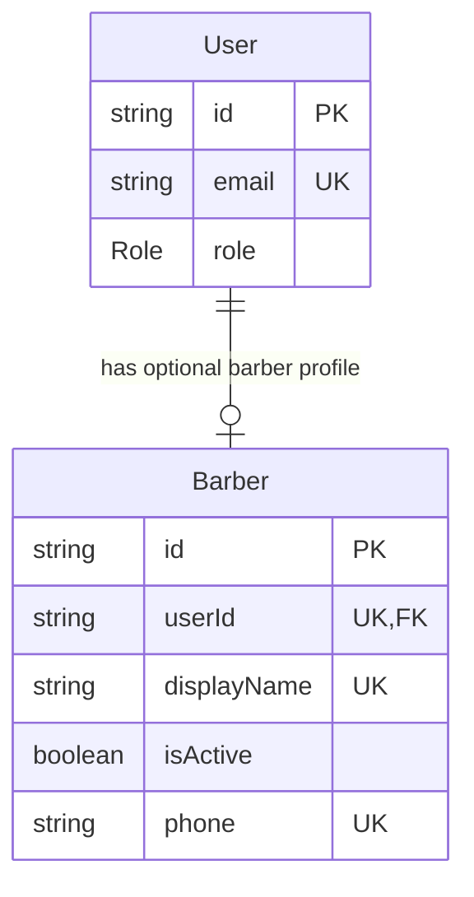
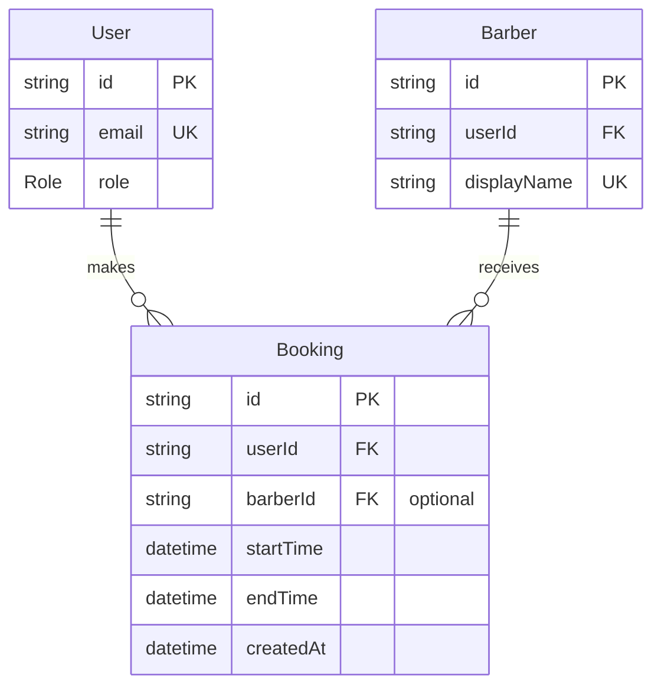
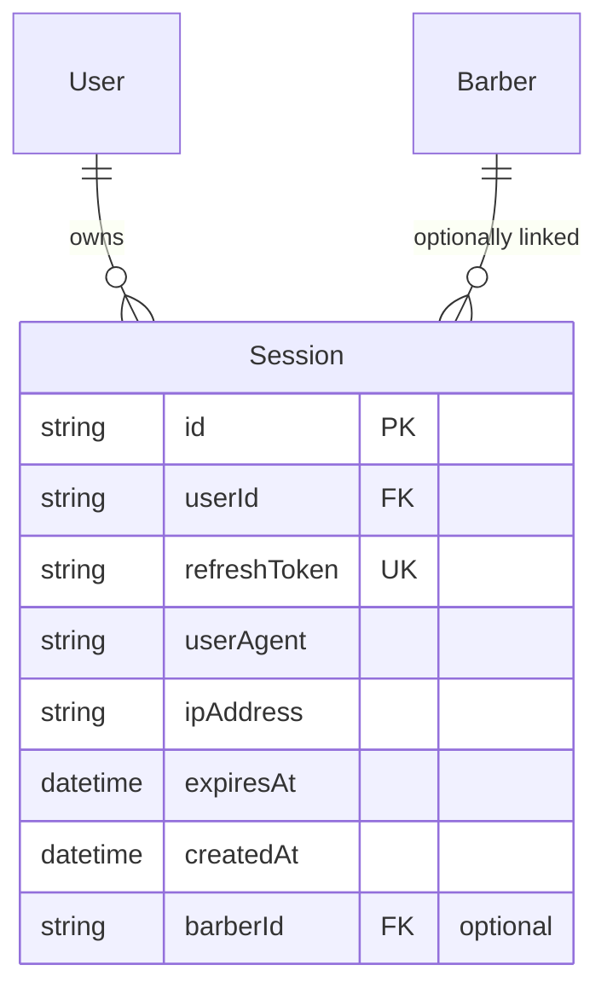
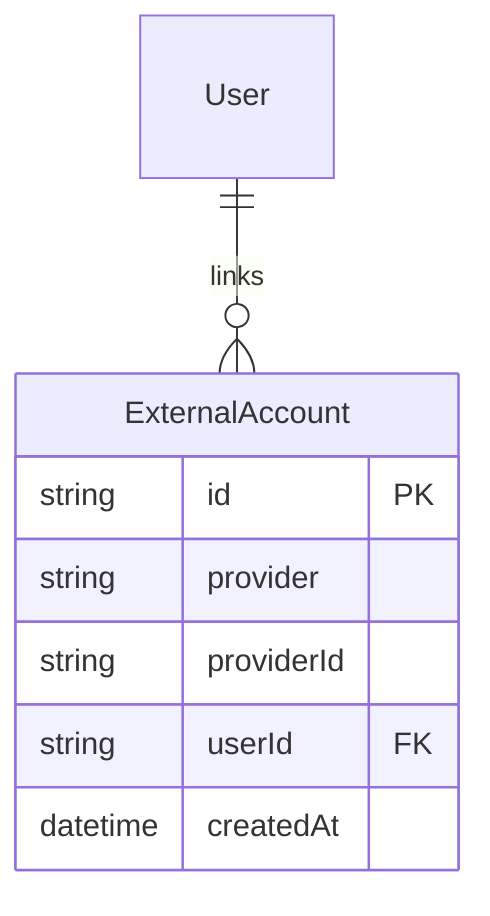
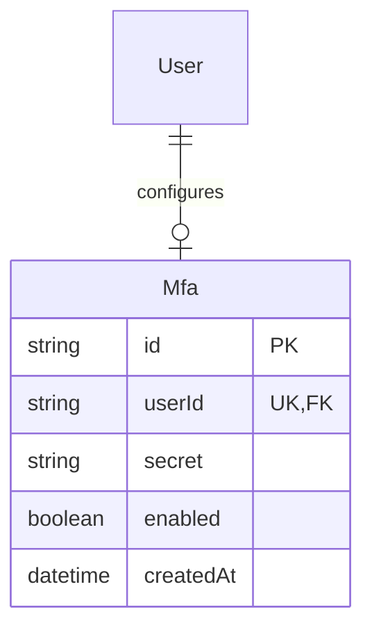
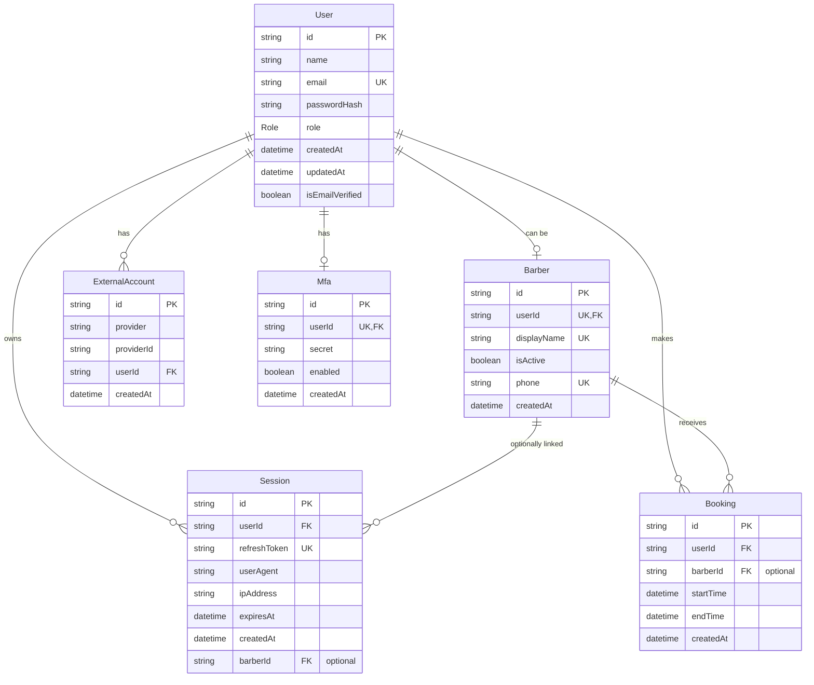

# Database Design

This note explains the current database design for Eric's Barbers, based on the Prisma schema in the backend project:

`erics-barber-api/prisma/schema.prisma`

The database is PostgreSQL, accessed through Prisma. The schema is centred around users, authentication sessions, barbers, and bookings.

## High-Level Overview

At a high level, the application stores:

- users who can register, log in, and make bookings
- barbers who are linked to user accounts
- bookings created by users and optionally assigned to barbers
- sessions for refresh-token based authentication
- external accounts for future social login support
- MFA records for future multi-factor authentication support

## Main Entities

## User

The `User` table is the central table in the schema. Every customer, barber, or admin is represented as a user.

Key fields:

| Field | Purpose |
| --- | --- |
| `id` | Primary key. Generated with `cuid()`. |
| `name` | Display name for the user. Defaults to `Anonymous`. |
| `email` | Unique login identifier. |
| `passwordHash` | Hashed password. Optional to allow for external auth in future. |
| `role` | Controls whether the user is an `ADMIN`, `BARBER`, or `CUSTOMER`. |
| `isEmailVerified` | Tracks whether the user has verified their email address. |
| `createdAt` | When the user was created. |
| `updatedAt` | Automatically updated when the user changes. |

Design decision:

The app uses a single `User` table for all account types, with a `role` enum to distinguish permissions. This keeps authentication simple because every person logs in through the same account model.

Trade-off:

Role-based modelling is simpler than having separate `Customer`, `Barber`, and `Admin` tables, but it means the application code must enforce permissions carefully. The schema says what role a user has, but the API must still check what each role is allowed to do.

## Barber

The `Barber` table represents users who can receive bookings.

Key fields:

| Field | Purpose |
| --- | --- |
| `id` | Primary key. |
| `userId` | Unique link back to the `User` table. |
| `displayName` | Public-facing barber name. Must be unique. |
| `isActive` | Allows a barber to be disabled without deleting them. |
| `phone` | Barber contact number. Must be unique. |
| `createdAt` | When the barber record was created. |

Relationship:

Design decision:

A barber is not a completely separate kind of account. A barber is a `User` with an additional `Barber` profile.

Trade-off:

This avoids duplicating login data, but it creates a two-step concept: first a user exists, then that user may also have a barber profile. The API needs to keep the user's `role` and the existence of a `Barber` record consistent.

## Booking

The `Booking` table stores appointments.

Key fields:

| Field | Purpose |
| --- | --- |
| `id` | Primary key. Generated with `uuid()`. |
| `userId` | The customer who made the booking. |
| `barberId` | Optional barber assigned to the booking. |
| `startTime` | Appointment start time. |
| `endTime` | Appointment end time. |
| `createdAt` | When the booking was created. |

Relationship:

Design decision:

A booking always belongs to a user, but the barber relationship is optional. This allows the system to create bookings before a barber is assigned, or to support flows where the customer chooses a time before choosing a specific barber.

Trade-off:

An optional barber makes booking creation more flexible, but it also means the application must decide what an unassigned booking means operationally. For example, the UI and admin workflows need to make it clear whether a booking is confirmed, pending assignment, or incomplete.

Current note:

The schema contains a `Services` enum with `Haircut`, `Beard`, and `Full`, but the `Booking` table does not currently store a service value. If the product needs customers to choose a service, the schema will likely need either:

- a `service` field on `Booking`, or
- a separate `Service` table if services need prices, durations, descriptions, or availability rules.

## Session

The `Session` table stores refresh-token sessions.

Key fields:

| Field | Purpose |
| --- | --- |
| `id` | Primary key. |
| `userId` | User who owns the session. |
| `refreshToken` | Unique stored refresh token value. In application code, this is intended to be hashed. |
| `userAgent` | Browser/device information. |
| `ipAddress` | IP address associated with the session. |
| `expiresAt` | When the refresh session expires. |
| `createdAt` | When the session was created. |
| `barberId` | Optional link to a barber. |

Relationship:

Design decision:

The application does not rely only on stateless JWTs. It also stores refresh-token sessions in the database. This supports logout, session invalidation, and refresh-token rotation.

Trade-off:

Database-backed sessions give more control and are safer for logout, but they add complexity. The API must correctly create, rotate, expire, and delete sessions.

Current note:

The optional `barberId` on `Session` is unusual because a session already belongs to a `User`, and a barber is also linked to a user. If barber-specific sessions are needed, this may be useful. If not, it could be simplified later.

## ExternalAccount

The `ExternalAccount` table is designed for third-party authentication providers.

Key fields:

| Field | Purpose |
| --- | --- |
| `id` | Primary key. |
| `provider` | Name of the external provider, such as Google. |
| `providerId` | User identifier from that provider. |
| `userId` | Local user account linked to the external provider. |
| `createdAt` | When the external account link was created. |

Relationship:

Design decision:

External accounts are separate from users, which allows one user to have multiple login providers in the future.

Trade-off:

This is flexible, but it adds a table that may not be needed until social login is actually implemented.

Important constraint:

`provider` and `providerId` are unique together. That prevents the same external account from being linked more than once.

## Mfa

The `Mfa` table stores multi-factor authentication data.

Key fields:

| Field | Purpose |
| --- | --- |
| `id` | Primary key. |
| `userId` | The user this MFA record belongs to. |
| `secret` | TOTP secret. |
| `enabled` | Whether MFA is enabled. |
| `createdAt` | When MFA was configured. |

Relationship:

Design decision:

MFA is modelled as a separate optional one-to-one table instead of storing MFA fields directly on `User`.

Trade-off:

This keeps the user table simpler and makes MFA easier to evolve, but it adds another join when reading full account security settings.

## Full Entity Relationship Diagram

## Relationship Summary

| Relationship | Meaning |
| --- | --- |
| `User -> ExternalAccount` | One user can have many external login providers. |
| `User -> Mfa` | One user can have one MFA setup. |
| `User -> Session` | One user can have many active or historical sessions. |
| `User -> Booking` | One user can make many bookings. |
| `User -> Barber` | One user can optionally have one barber profile. |
| `Barber -> Booking` | One barber can have many bookings. |
| `Barber -> Session` | One barber can optionally be linked to many sessions. |

## Constraints and Indexes

Important constraints:

- `User.email` is unique.
- `Barber.userId` is unique, so one user can only have one barber profile.
- `Barber.displayName` is unique.
- `Barber.phone` is unique.
- `Session.refreshToken` is unique.
- `ExternalAccount.provider + ExternalAccount.providerId` is unique as a pair.
- `Booking.userId` has an index to make user booking lookups faster.

Cascade behaviour:

- Deleting a `User` cascades to their `Barber` profile.
- Deleting a `User` cascades to their `Booking` records.

## Current Design Trade-Offs

The current schema is a good foundation for authentication and booking, but there are some intentional or likely trade-offs:

- A single `User` table with roles keeps authentication simple, but requires strong role checks in the API.
- `Barber` as a separate profile keeps barber-specific data out of `User`, but the app must keep `User.role` and `Barber` records aligned.
- Optional `Booking.barberId` makes booking flexible, but the product needs to define what unassigned bookings mean.
- Database-backed sessions support logout and refresh-token invalidation, but make auth more complex than purely stateless JWTs.
- `ExternalAccount` and `Mfa` suggest future-proofing, but they add schema surface before those flows are fully built.
- The `Services` enum exists, but services are not yet connected to bookings. This will likely need to change before the booking flow is complete.

## Mental Model

The easiest way to understand the database is:

1. Everyone starts as a `User`.
2. Some users may also become `Barber` records.
3. Customers create `Booking` records.
4. Bookings can optionally be assigned to barbers.
5. Authentication is supported by `Session`, `Mfa`, and `ExternalAccount`.

