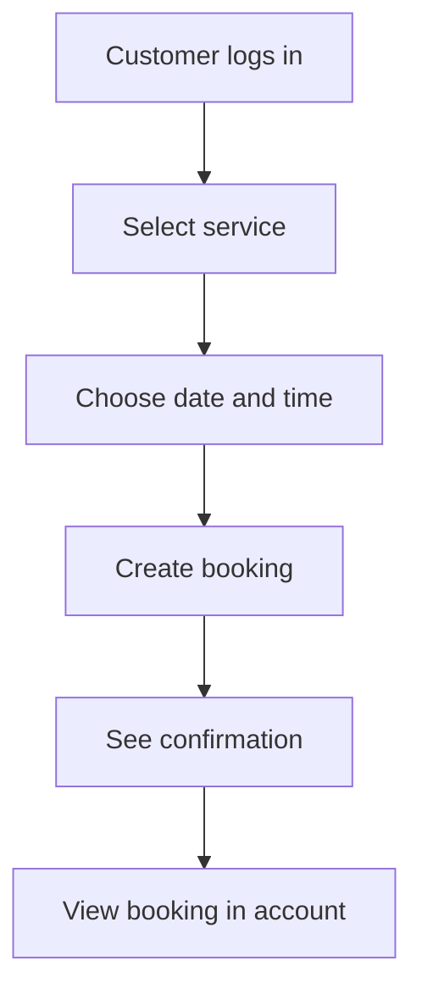

# Known Gaps and Roadmap

Status: planning and current gaps note.

This note records what is implemented, what is incomplete, and what should be prioritized next.

Related notes:

- [[Project Overview]]
- [[Current System Architecture]]
- [[Authentication Flows]]
- [[Database Design]]

## Current Implementation Snapshot

The project is partially built.

The authentication flow is the main implemented feature. Booking, barber management, payments, notifications, and admin workflows are either placeholders or backend foundations.

## Implemented

## Authentication

Implemented:

- registration endpoint
- registration frontend page
- password hashing with bcrypt
- email verification email through Resend
- email verification endpoint
- email verification frontend page
- resend verification email flow
- login endpoint
- login frontend page
- access-token creation
- refresh-token creation
- session row creation in PostgreSQL
- protected backend profile endpoint
- frontend `/my-account` route protection
- logout flow foundation

Known gaps:

- frontend refresh-token flow is not complete
- email verification does not store the returned access token in the frontend `accessToken` cookie
- logout route does not clearly forward the backend refresh cookie
- logout route returns `Logged in` instead of `Logged out`
- refresh-token hashing and lookup should be reviewed
- role enforcement is not complete

## Database

Implemented:

- user table
- session table
- barber table
- booking table
- MFA table foundation
- external account table foundation
- Prisma migrations
- generated Prisma client

Known gaps:

- `Services` enum exists but is not connected to bookings
- booking does not currently store a selected service
- booking does not have a status field
- booking does not store cancellation metadata
- barber availability is not modelled yet

## Frontend

Implemented:

- home page
- navigation and footer
- register page
- login page
- verify email page
- email verification callback page
- my account placeholder
- services page
- booking page placeholder and feature flag

Known gaps:

- no complete booking creation UI
- no booking management UI
- no barber dashboard
- no admin dashboard
- no profile editing UI
- services are static and not connected to the backend
- user feedback and validation states are inconsistent across pages

## Backend

Implemented:

- NestJS app bootstrap
- Swagger setup
- CORS configuration
- helmet middleware
- cookie parser
- global validation pipe
- auth module
- booking module foundation
- barbers module foundation
- health module
- payments placeholder
- notifications placeholder

Known gaps:

- role guard is empty
- booking authorization is not complete
- barber controller request binding needs review
- booking service uses generic `Error` instead of Nest exceptions
- DTO validation is inconsistent outside auth
- payments module is placeholder-level
- notifications module is placeholder-level

## Priority Roadmap

## Phase 1: Stabilize Authentication

Goal:

Make the existing authentication flow reliable before building more features on top of it.

Tasks:

- fix logout response message
- make logout reliably invalidate backend sessions
- implement or simplify refresh-token flow
- review refresh-token hashing strategy
- make email verification route store auth state consistently or redirect to login intentionally
- add tests for login, logout, verification, refresh, and profile
- ensure local development cookie behavior is documented and working

Why this comes first:

Booking will depend on knowing who the current user is. If auth is unstable, every user-facing feature becomes harder to debug.

## Phase 2: Implement Role Enforcement

Goal:

Make customer, barber, and admin permissions real.

Tasks:

- implement `RolesGuard`
- apply role guard consistently
- include role data in access tokens if needed
- define what each role can do
- document permissions in a dedicated `Roles and Permissions` note
- add tests for forbidden and allowed role scenarios

Why this matters:

The app already has `@Roles(...)` decorators and a `Role` enum, but permissions are not fully enforced yet. Booking and barber workflows will need reliable authorization.

## Phase 3: Build Minimum Booking Flow

Goal:

Allow a logged-in customer to create and view a booking.

Tasks:

- connect services to bookings
- decide whether service should be an enum or a `Service` table
- add booking status, such as pending, confirmed, cancelled
- build booking form on the frontend
- validate date and time input
- prevent past bookings
- prevent duplicate time slots
- assign a barber or define unassigned booking behavior
- show the customer's bookings
- add backend tests for booking creation and listing

Minimum useful customer flow:

## Phase 4: Barber Management

Goal:

Let the business manage barbers and let barbers see their bookings.

Tasks:

- build barber onboarding flow
- ensure creating a barber also aligns the user's role
- build barber-facing bookings view
- decide whether barbers use the same frontend or a separate subdomain
- model barber availability
- support active/inactive barber state in the UI

Design question:

Should barber features live in the same Next.js app under routes like `/barber`, or should there be a separate subdomain such as `barber.erics-barbers...`?

## Phase 5: Admin and Operations

Goal:

Give the shop owner/admin enough control to operate the application without developer intervention.

Tasks:

- admin dashboard
- manage services and prices
- manage barbers
- view all bookings
- cancel or reschedule bookings
- basic audit trail for operational actions

## Phase 6: Production Readiness

Goal:

Make the app safer and easier to run in production.

Tasks:

- deployment guide
- release checklist
- database backup plan
- logging strategy
- monitoring and alerting
- stronger error handling
- rate limiting review
- security review
- accessibility review
- end-to-end tests for core user journeys

## Feature Status Table

| Feature | Status | Notes |
| --- | --- | --- |
| Registration | Implemented | Needs stronger test coverage. |
| Email verification | Implemented | Auth state after verification needs review. |
| Login | Implemented | Uses Next.js API route and backend auth endpoint. |
| Logout | Partial | Needs cookie forwarding/session invalidation review. |
| Refresh token | Backend partial | Frontend route/flow not complete. |
| Profile | Partial | Backend read/update exists, frontend page is minimal. |
| Booking creation | Partial | Backend foundation exists, frontend placeholder. |
| Booking management | Not implemented | Needs customer-facing and barber/admin-facing flows. |
| Barber management | Partial | Backend foundation exists, frontend missing. |
| Role enforcement | Partial | Decorators exist, guard not implemented. |
| Services | Partial | Static frontend table, schema enum not connected to booking. |
| Payments | Placeholder | Module exists but not implemented. |
| Notifications | Placeholder | Module exists but not implemented. |
| Health checks | Implemented | Database and Resend health checks exist. |

## Technical Debt

## Auth Technical Debt

- mixed frontend auth request paths
- refresh-token lookup and invalidation design needs review
- no complete frontend refresh flow
- logout route message is incorrect
- generated OpenAPI client has `WITH_CREDENTIALS` set to `false`

## API Technical Debt

- role guard is empty
- some DTOs do not have validation decorators
- generic errors should be replaced with Nest exceptions
- e2e tests are minimal
- some tests appear to reference older DTO names or use case signatures

## Frontend Technical Debt

- some route pages are placeholders
- UI styling is inconsistent in places
- auth state is handled through cookies, localStorage, generated clients, and route handlers, which needs consolidation
- static services page is not connected to backend data

## Database Technical Debt

- services need a clear model
- booking needs status and cancellation fields
- barber availability needs a model
- session model may not need `barberId`

## Documentation Roadmap

Useful docs to add next:

- `Frontend Architecture.md`
- `Backend Architecture.md`
- `API Design.md`
- `Roles and Permissions.md`
- `Booking Flow - Planned.md`
- `Barber Dashboard - Planned.md`
- `Testing Strategy.md`
- `Deployment Guide.md`
- `ADR - Auth Cookie Strategy.md`
- `ADR - Booking Domain Model.md`

## Guiding Principle

Keep the documentation honest:

- current docs should describe what exists
- planned docs should describe what is intended
- decision records should explain why choices were made

That will make the project easier for future developers to join without being misled by aspirational documentation.

