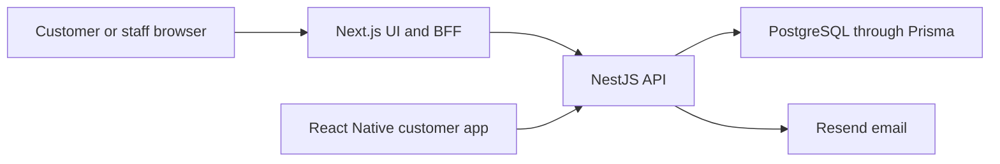

# Project Overview

Status: current product overview for a partially implemented cross-platform system.

Eric's Barbers is a booking product with a shared NestJS backend, a Next.js web application, and a React Native customer application for iOS and Android. Customers can use the website without installing anything; the mobile app is being added primarily for repeat customers while preserving guest booking.

The web product also contains staff and administration interface foundations. Mobile 1.0 is customer-only. No staff or administration mobile release has been accepted.

Related notes:

- [[Shared Product Requirements]]
- [[Web Client Requirements]]
- [[Web App Delivery Roadmap]]
- [[Mobile App Requirements]]
- [[Mobile App Delivery Roadmap]]
- [[Current System Architecture]]
- [[Authentication Flows]]
- [[Known Gaps and Roadmap]]

## Product Problem

Barbers often need to interrupt their work to answer booking calls or manage appointment requests manually. Eric's Barbers lets customers handle common booking tasks themselves while giving the shop a reliable shared record of services, availability, appointments, and customers.

The original product assumption was that a responsive website would be sufficient. Client feedback showed that roughly 90% of customers are repeat users, making an installed mobile experience valuable for fast return visits and future native capabilities. The website remains important for discovery, one-time visitors, guest journeys, staff, and administration.

## Product Surfaces

| Surface | Audience | Responsibility | State |
| --- | --- | --- | --- |
| Next.js web app | Customers, staff, admins | Browser journeys and the browser authentication BFF | Active; customer flows have substantial foundations, staff/admin remain incomplete |
| React Native app | Customers and guests | Native iOS/Android customer journeys | Expo scaffold exists; Mobile 1.0 delivery is in progress |
| NestJS API | All supported clients | Business rules, authentication, authorization, availability, and booking integrity | Active shared backend |
| PostgreSQL | Backend only | Durable application data through Prisma | Active |

## Customer Capabilities

The shared product direction includes:

- browse active services and barbers;
- view valid availability;
- register, verify an email address, log in, complete MFA, and recover an account;
- create a booking as a guest or authenticated customer;
- view, reschedule, or cancel eligible bookings;
- retain accepted service terms on booking history; and
- receive operational email for relevant account and booking events.

The API is the enforcement boundary for shared booking, identity, authorization, and data-integrity rules. Web and mobile may present these journeys differently but must not implement conflicting business behavior.

## Staff and Administration Direction

The web application is the current home for barber, staff, and administration work. Live availability management, complete operational authorization, and administration workflows remain later web outcomes.

Staff and administration mobile interfaces are deliberately undecided. They require a separate business case, requirements baseline, security analysis, UX design, and architectural decision before being assigned to a mobile release.

## Technology Summary

### Web client

`erics-barbers-ui` uses Next.js 16, React 19, TypeScript, Material UI, Tailwind CSS, and generated OpenAPI code. Browser authentication goes through Next.js route handlers, which manage HttpOnly access and refresh cookies.

### Mobile client

`erics-barbers-app` uses React Native, Expo, Expo Router, and TypeScript. It follows Expo Continuous Native Generation: native projects are generated locally from app configuration and config plugins rather than committed initially.

The app will call NestJS directly. Native authentication will use an intentional bearer/refresh-token contract, secure durable credential storage, and in-memory access/session state. It will not reuse the browser BFF or infer client type from incidental headers.

### Backend and data

`erics-barber-api` uses NestJS 11, Prisma 7, PostgreSQL, JWT authentication, bcrypt, Resend, Swagger/OpenAPI, Jest, and Supertest.

Railway is the accepted managed host for the NestJS API, PostgreSQL, and future backend cron or worker services. Production and test backend resources are isolated in separate Railway environments; Vercel remains responsible for the Next.js frontend and browser BFF. See [[ADR 0026 - Use Railway For Backend Hosting]].

The API repository owns the canonical generated `openapi/openapi.json`. Web and mobile client code must be generated from synchronized copies of that artifact rather than separately maintained contracts.

## High-Level Architecture

The web and native authentication transports differ, but both terminate at the same backend use cases and session model. The API must authenticate and authorize explicitly rather than guessing which client sent a request.

## Delivery Direction

Web delivery is organized into outcome-based releases in [[Web App Delivery Roadmap]]. Mobile delivery is organized into dependency-aware increments in [[Mobile App Delivery Roadmap]] and executed through [[Mobile App Delivery Backlog]].

The Mobile 1.0 path is:

1. stabilize the API/OpenAPI and native authentication contracts;
2. establish mobile application architecture and environments;
3. deliver public customer discovery;
4. deliver the guest booking lifecycle;
5. deliver native accounts and session restoration;
6. deliver signed-in repeat-customer booking journeys; and
7. complete application links and release evidence.

Push notifications and payments are known future possibilities, not Mobile 1.0 commitments.

## Documentation Model

- [[Shared Product Requirements]] records client-neutral business rules.
- Client requirement documents record web- or mobile-specific behavior.
- Current-state notes describe what is implemented today.
- Delivery roadmaps allocate outcomes without pretending planned features exist.
- ADRs record accepted architectural decisions and their consequences.
- Tickets track execution and link back to these sources of truth.
