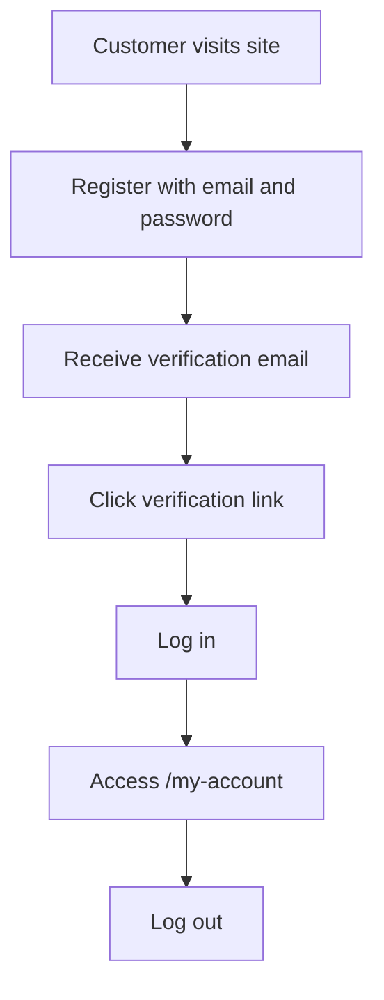

# Project Overview

Status: partially implemented.

Eric's Barbers is a full-stack web application for a barbershop. The long-term goal is to let customers create accounts, verify their email, log in, and manage appointments online, while giving barbers a separate way to view and manage their working day.

At the moment, the authentication flow is the most complete part of the project. Booking and barber management exist as early backend and frontend foundations, but they are not complete end-to-end features yet.

Related notes:

- [[Authentication Flows]]
- [[Database Design]]
- [[Roles and Permissions]]
- [[Current System Architecture]]
- [[Known Gaps and Roadmap]]
- [[Shared Product Requirements]]
- [[Web Client Requirements]]
- [[Web App Delivery Roadmap]]
- [[Mobile App Requirements]]
- [[Mobile App Delivery Roadmap]]

## Product Problem

The project is based on a real-world observation: barbers often need to stop cutting hair to answer booking calls or manage appointment requests manually.

The application is intended to reduce that friction by letting customers handle common booking tasks themselves:

- register for an account
- verify their email address
- log in securely
- view available services
- create a booking
- manage or cancel an existing booking

For the barber, the eventual value is:

- fewer phone interruptions
- clearer appointment visibility
- less manual admin
- a digital record of bookings and customers

## Current Product Scope

## Implemented Today

The currently implemented product surface is mostly authentication:

- user registration
- password hashing on the backend
- email verification emails through Resend
- email verification page on the frontend
- login through a Next.js API route
- access-token cookie on the frontend domain
- backend JWT access-token verification
- basic protected `/my-account` route
- logout flow foundation
- database schema for users and sessions

## Partially Implemented

These features have some code or schema support, but are not complete end-to-end:

- booking API module
- barber API module
- booking database table
- barber database table
- service database table with prices, durations, and descriptions
- service listing page
- feature flag for booking availability
- refresh-token session model
- password reset endpoints
- MFA-related data model and endpoint foundation

## Not Yet Implemented

These are planned or implied by the product, but not yet complete:

- customer booking creation flow
- customer booking management flow
- barber dashboard
- barber availability management
- cancellation flow
- booking status lifecycle
- customer-facing service selection connected to live booking creation
- role-based authorization enforcement
- production-ready refresh-token flow on the frontend
- admin tooling for onboarding barbers

## Main User Groups

## Customers

Customers are everyday users who want to book and manage appointments.

Expected customer actions:

- register
- verify email
- log in
- view services
- create booking
- view bookings
- update or cancel bookings

Current state:

Customers can register, verify email, and log in. Booking-related flows are still incomplete.

## Barbers

Barbers are users who need to manage their appointment schedule.

Expected barber actions:

- view upcoming bookings
- manage availability
- see customer appointment details
- potentially update booking state

Current state:

The database has a `Barber` model and the backend has a barbers module, but there is no complete barber-facing frontend yet.

## Admins

Admins are expected to manage application-level setup.

Expected admin actions:

- create or onboard barbers
- manage services
- view or manage all bookings
- handle operational changes

Current state:

The schema has an `ADMIN` role, but role-based enforcement is not complete.

Role definitions and intended permission boundaries are documented in [[Roles and Permissions]].

## Technology Summary

## Frontend

The main frontend is:

`erics-barbers-ui`

Key technologies:

- Next.js 16
- React 19
- TypeScript
- Material UI
- Tailwind CSS
- generated OpenAPI client
- Next.js API routes for selected auth flows

The frontend uses the Next.js app directory. Routes are represented by folders under `app/`.

## Backend

The backend is:

`erics-barber-api`

Key technologies:

- NestJS 11
- TypeScript
- Prisma 7
- PostgreSQL
- JWT authentication
- bcrypt password hashing
- Resend email integration
- Swagger/OpenAPI
- Terminus health checks
- Jest and Supertest

The backend is organized into feature modules, such as auth, booking, barbers, health, notifications, and payments.

## Database

The database is PostgreSQL and is accessed through Prisma.

Main tables:

- `User`
- `Session`
- `Booking`
- `Barber`
- `Mfa`
- `ExternalAccount`

The database design is documented in [[Database Design]].

## Current User Journey

The most complete user journey is authentication.

Current limitations:

- email verification does not currently store the returned access token in the same frontend cookie used by login
- `/my-account` is protected, but the page itself is still minimal
- refresh-token handling is not fully wired through the frontend

## Product Direction

The next major product milestone is a usable booking flow.

The smallest useful version would allow:

1. a customer to log in
2. a customer to select a service
3. a customer to choose a date and time
4. the backend to calculate appointment duration from the selected service and prevent unavailable or past booking times
5. the customer to see their booking after creation
6. the barber or admin to view upcoming bookings

After that, the application can grow into:

- barber-specific dashboard
- admin dashboard
- service and pricing management
- availability rules
- booking reminders
- payment support
- cancellation and rescheduling policies

## Documentation Approach

Because the project is partially implemented, documentation should be split into:

- current implementation docs
- planned design docs
- decision records
- roadmap docs

This avoids pretending unfinished features already exist, while still capturing the intended direction of the system.
